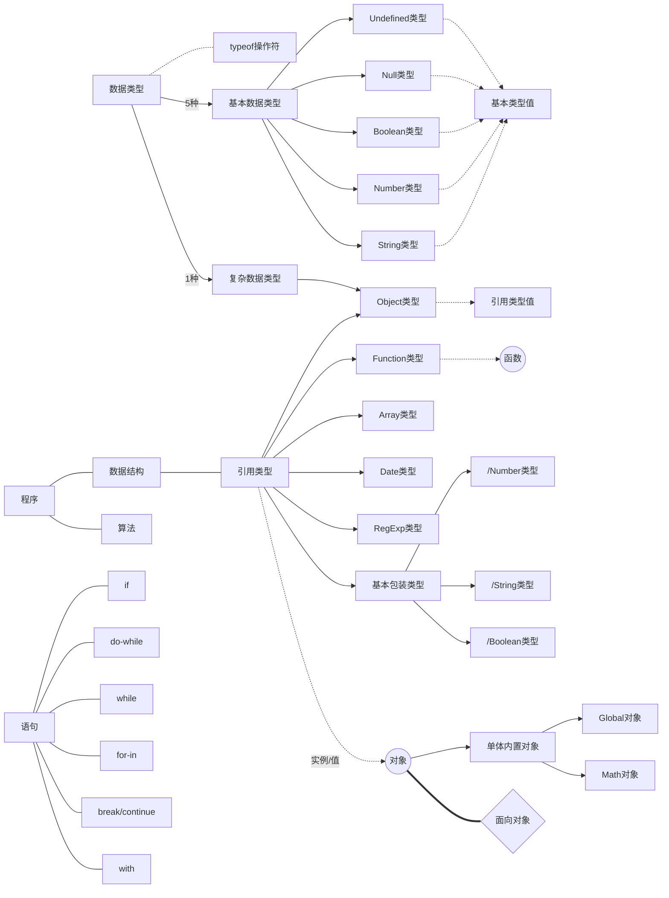

[TOC]
- [基础](#基础)
  - [语言](#语言)
    - [数据类型](#数据类型)
      - [Undefined类型](#undefined类型)
      - [Null类型](#null类型)
      - [Boolean类型](#boolean类型)
      - [Number类型](#number类型)
      - [String类型](#string类型)
      - [<a href="#Object">Object类型</a>](#object类型)
      - [变量（类型值）](#变量类型值)
        - [基本类型值和引用类型值](#基本类型值和引用类型值)
        - [检测类型](#检测类型)
        - [执行环境及作用域](#执行环境及作用域)
    - [数据结构（原生引用类型）](#数据结构原生引用类型)
      - [<a href="#Object">Object类型</a>](#object类型-1)
      - [Array类型](#array类型)
        - [使用数组](#使用数组)
          - [调用String对象的split()方法生成数组](#调用string对象的split方法生成数组)
        - [存取函数（访问数组元素，返回目标数组的某种变体）](#存取函数访问数组元素返回目标数组的某种变体)
          - [```indexOf()``` ```lastIndexOf()```  查找元素](#indexof-lastindexof-查找元素)
          - [```join()``` ```toString()``` 字符串表示](#join-tostring-字符串表示)
          - [```concat()``` ```splice()``` 由已有数组创建新数组](#concat-splice-由已有数组创建新数组)
        - [可变函数](#可变函数)
          - [```push()``` ```unshift()``` 添加元素](#push-unshift-添加元素)
          - [```pop()``` ```shift()``` 删除元素](#pop-shift-删除元素)
          - [```splice()```](#splice)
          - [```reverse()``` ```sort()``` 排序](#reverse-sort-排序)
        - [迭代器方法](#迭代器方法)
          - [```forEach()``` ```every()``` ```some()``` 归并方法 ```reduce()``` ```reduceRight()``` 不生成新数组](#foreach-every-some-归并方法-reduce-reduceright-不生成新数组)
          - [```map()``` ```filter()``` 生成新数组](#map-filter-生成新数组)
          - [```find()``` ```findIndex()``` es6](#find-findindex-es6)
      - [Date类型](#date类型)
      - [RegExp类型](#regexp类型)
      - [Function类型](#function类型)
        - [函数](#函数)
          - [函数定义](#函数定义)
          - [函数参数](#函数参数)
          - [函数内部属性](#函数内部属性)
      - [基本包装类型](#基本包装类型)
        - [Boolean类型](#boolean类型-1)
        - [Number类型](#number类型-1)
        - [String类型](#string类型-1)
      - [单体内置对象](#单体内置对象)
        - [内置对象](#内置对象)
        - [Global对象](#global对象)
        - [Math对象](#math对象)
  - [<a name="Object">面向对象</a>](#面向对象)
    - [对象](#对象)
      - [属性](#属性)
        - [属性类型](#属性类型)
        - [属性相关方法](#属性相关方法)
      - [创建对象](#创建对象)
        - [工厂模式](#工厂模式)
        - [构造函数模式](#构造函数模式)
        - [原型模式](#原型模式)
          - [原型对象相关方法](#原型对象相关方法)
# 基础

## 语言




### 数据类型

#### Undefined类型

只有一个值：```undefined```

是为了区分空对象指针和未经初始化的变量

*未初始化的变量*和*未声明的变量*执行```typeof```都返回"```undefined```"值。若能显式地初始化变量，当```typeof```返回"```undefined```"时，就能知道该变量还没声明，而不是没初始化。

#### Null类型

只有一个值：```null```

null值表示一个空对象指针

```typeof```检测```null```值时会返回“```object```”

若定义的变量将来准备用于保存对象，最好将该变量初始化为``null``而不是其它

#### Boolean类型

只有两个字面值：```true```、```false```

#### Number类型

```NaN```与任何值都不相等，包括其本身

#### String类型

ES中字符串不可变，要改变某个变量保存的字符串，需要销毁原来的字符串，再用另一个新字符串填充该变量。

#### <a href="#Object">Object类型</a>

#### 变量（类型值）

##### 基本类型值和引用类型值

将一个值赋给变量时，必须先确定该值是基本类型值还是引用类型值，**保存方式**不同

| 变量                                 | 基本类型值                                                                                                                                            | 引用类型值                                                                                                                             |
| ------------------------------------ | ----------------------------------------------------------------------------------------------------------------------------------------------------- | -------------------------------------------------------------------------------------------------------------------------------------- |
| **含义**                             | 简单数据段                                                                                                                                            | 多值构成，保存在内存中的对象                                                                                                           |
| **操作**                             | 1. 按值访问，可以操作保存在变量中实际的值 2.不能添加属性                                                                                              | 1. 按引用访问，操作的是对象的引用（JS中不能直接访问内存中的位置，即不能直接操作对象的内存空间）2. 可以动态添加、改变、删除其属性和方法 |
| **复制**                             | 在变量对象上创建一个新值，再把该值复制到为新变量分配的位置上                                                                                          | 值的副本是一个指针，指向存储在堆中的一个对象。两个变量将引用同一个对象                                                                 |
| <a name="parameter">**传递参数**</a> | **所有函数的参数都是按值传递 把函数外部的值复制给函数内参数相当于变量的复制** 被传递的值复制给一个局部变量（即命名参数，```arguments```对象中的元素） | 被传递的值在内存中的地址复制给一个局部变量(该局部变量的变化会反映在函数外部 并不意味着是引用传递 引用不会另外分配内存 只是一个别称)    |

##### 检测类型

检测一个变量是否为基本数据类型：```typeof```操作符

检测一个值是什么类型的对象：```instanceof```操作符：```result = variable instanceof constructor```

##### 执行环境及作用域

环境定义了变量或函数有权访问的其它数据。每个执行环境都有一个相关联的**变量对象**，环境中定义的所有变量和函数都保存在这个对象中。

只有两种执行环境：全局和局部（函数），没有块级作用域

最外围的执行环境：**全局执行环境**，表示执行环境的对象根据ES的宿主环境而定，Web浏览器中是```window```对象。

当执行环境中代码执行完，环境即被销毁，其中的变量和函数也随之销毁，全局环境直到应用程序退出时销毁，如关闭网页或浏览器

每个**函数（局部执行环境）**都有自己的执行环境。执行流进入函数时，函数的环境被推入一个环境栈中。执行完，栈将其环境弹出，控制权返回给之前的环境

代码在一个环境中执行时，会创建变量对象的**作用域链**。作用域链是为了保证对执行环境有权访问的所有变量和函数的有序访问。标识符解析沿着作用域链从前端开始逐级向后回溯搜索标识符

> 延长作用域链


### 数据结构（原生引用类型）

#### <a href="#Object">Object类型</a>

ES中的对象就是一组数据和功能的集合

Object类型是所有ES中实例的基础，Object类型所具有的属性和方法也存在于所有对象中：

- constructor
- hasOwnProperty(*propertyname*)： *propertyName*必须是字符串形式
- isPrototypeOf(object)
- propertyIsEnmerable(*propertyName*)
- toLocaleString()
- toString()
- valueOf()


#### Array类型

##### 使用数组

> 创建

1. 使用数组字面量表示法（推荐）```[]```
2. 使用Array构造函数

###### 调用String对象的split()方法生成数组

```javascript
const sentence = "What a beautiful world";
const words = sentence.split(" ");
```


##### 存取函数（访问数组元素，返回目标数组的某种变体）

###### ```indexOf()``` ```lastIndexOf()```  查找元素


###### ```join()``` ```toString()``` 字符串表示

当对数组使用```print()```函数时，会自动调用```toString()```，会显示分割的逗号，可以使用```jooin()```方法传入一个空字符串

###### ```concat()``` ```splice()``` 由已有数组创建新数组

```concat()```方法基于当前数组所有项，先创建当前数组的一个副本，然后将接收的参数添加到其末尾返回

```splice()```方法基于当前数组的一或多项，返回的数组包含从原始数组中删除的项


##### 可变函数

###### ```push()``` ```unshift()``` 添加元素

###### ```pop()``` ```shift()``` 删除元素

###### ```splice()```

```splice()```方法基于当前数组的一或多项，可用于删除、插入、替换，3个参数：

1. 起始索引
2. 需要删除的元素个数
3. 想添加进数组的元素

###### ```reverse()``` ```sort()``` 排序

```sort()```方法是按照字典顺序对元素进行排序的，假定元素都是字符串类型

可以在调用时传入一个比较函数```compare()```


##### 迭代器方法

```forEach()``` ```every()``` ```some()``` ```map()``` ```filter()```5个迭代器方法均接收2个参数：要在每一项上运行的函数、运行该函数的作用域对象（可选）
传入的函数接收3个参数：数组项的值、该项在数组中的位置、数组对象本身

###### ```forEach()``` ```every()``` ```some()``` 归并方法 ```reduce()``` ```reduceRight()``` 不生成新数组

```javascript
// every()
Array.prototype.myEvery = function(fn) {
    let flag = true;
    for(let i=0; i < this.length; i++) {
        flag = fn(this[i]);
        if(!flag) flag = false;
    }
    return flag;
};
```

```javascript
// some()
Array.prototype.mySome = function(fn) {
    for(let i = 0; i < this.length; i++) {
        let flag = fn(this[i]);
        if(flag) return flag;
    }
    return false;
};
```

归并方法接收2个参数：在每一项上调用的函数、作为归并基础的初始值（可选）
传入的函数接收4个参数：前一个值、当前值、项的索引、数组对象

```javascript
// reduce()
Array.prototype.myReduce = function(reducer, initialVal) {
    let prev = initialVal || this[0]; // 数组第一项
    for(let i = 0; i < this.length; i++) {
        prev = reducer(prev, this[i], i, this);
    }
    return prev;
};

let result = [1, 2, 3, 4, 5].myReduce((prev, next, index, current) => {
  if (index == current.length - 1) return (prev + next) / current.length;
  return prev + next;
}); // 参数代表手动指定数组的第一项，数组的长度不会变
console.log(result);
```

###### ```map()``` ```filter()``` 生成新数组

```javascript
// filter()
Array.prototype.myFilter = function(callback) {
    let arr = [];
    for(let i = 0; i < this.length; i++) {
        callback(this[i], i) ? arr.push(this[i]) : void 0;
    }
    return arr;
}; // 逐一传入item 返回ture表示当前项留下，保留在新数组，返回false表示不留
```

###### ```find()``` ```findIndex()``` es6

```javascript
// find()
let arr = [1, 2, 3];
let result = arr.find(function(item) {
    return item == 2;
});

Array.prototype.myFind = function(fn) {
    for(let i=0; i < this.length; i++) {
        let flag = fn(this[i]);
        if(flag) return this[i];
    }
}; // 找到后返回的是当前项找不到返回undefined,找到后停止
```


#### Date类型

#### RegExp类型

#### Function类型

##### 函数

函数是Function类型的实例，具有属性和方法

函数名也是一个指向函数对象的**指针**。ES中**没有函数重载**，同名函数会覆盖，可以通过检查传入函数中参数的类型和数量并作出不同的反应来模仿方法的重载。函数可以**作为值**，传递给别的函数，或者作为别的函数的返回结果。

使用不带圆括号的函数名是访问函数指针，而非调用函数。

###### 函数定义

1. 函数声明语法定义

   ```javascript
   function functionName(arg0, arg1, ...) {
       statements
   }
   ```

   **函数声明提升：**可以在执行任何代码之前访问（函数表达式不可以）

2. 函数表达式定义（```;```）

   ```javascript
   var variable = function(arg0, arg1, ...) {
       statements
   };
   ```

3. Function构造函数定义

   ```javascript
   // 不推荐
   // 理解“函数是对象，函数名是指针”
   var variable = new Function("arg0", "arg1", "statements")
   ```

###### 函数参数

   ES中的参数在内部是用一个**数组**来表示的，函数接收的是这个数组，因此参数的数量和数据类型不定。

   在函数体内可以通过**```arguments```对象**来访问参数数组，```arguments```对象可以使用方括号访问数组元素，具有```length```属性。```arguments```对象中的值与对应的命名参数的值同步，但二者内存空间是独立的。```arguments```对象的长度由传入的参数个数决定，而非由定义函数时的命名参数的个数决定。没有传递值得命名参数将自动赋予```undefined```值。

关于<a href="#parameter">参数传递</a>

###### 函数内部属性

> 两个特殊对象：```arguments```和```this```

**```this```**对象引用的是函数执行的环境对象，在调用函数之前```this```的值并不确定。```window.color()```与```o.color()```中的```this```引用的对象不同，但这两个函数指向的是同一个函数。

> 非继承而来的方法：```apply()```、```call()```、```bind()```

用途都是在特定的作用域中调用函数，等于设置函数体内```this```对象的值。

**```apply(作用域, 参数数组)```**

<a name="call">**```call(作用域, 参数)```**</a>只是接收参数方式不同，必须逐个列举

能够扩充函数赖以运行的作用域，对象与方法不需要有耦合关系

**```bind()```**创建一个函数的实例，其```this```值会被绑定到传给```bind()```函数的值

#### 基本包装类型

特殊引用类型```Boolean、`Number、String```同时具有与各自的基本类型相应的特殊行为

```javascript
const s1 = "some text";
const s2 = s1.substring(2);
```

在读取模式中访问一个基本类型值时，后台会创建一个相应的基本包装类型的对象，从而可以调用相应的方法来操作它们：

1. 创建相应基本包装类型的一个实例

   ```javascript
   let s1 = new String("some text");
   ```

2. 在实例上调用指定的方法

   ```javascript
   let s2 = s1.substring(2);
   ```

3. 销毁该实例

   ```s1 = null;```

引用类型与基本包装类型的主要区别就是对象的生存期。使用```new```操作符创建的引用类型实例，在执行流离开当前作用域之前都保存在内存中，而自动创建的基本包装类型的对象只存在于一行代码的执行瞬间

##### Boolean类型

##### Number类型

##### String类型

#### 单体内置对象

##### 内置对象

ES实现提供的、不依赖于宿主环境的对象，在ES程序执行前就已经存在了，不必显示实例化内置对象，已经实例化了。如Object、Array、String

##### Global对象

实际上所谓全局变量或全局函数，即在全局作用域中定义的属性和函数，都是```Global```对象的属性。

> ```Global```对象的属性

特殊值```undefined```、```NaN```、```Infinity```，所有原生引用类型的构造函数

> ```window```对象

Web浏览器将```Global```对象作为```window```对象的一部分加以实现

##### Math对象

## <a name="Object">面向对象</a>

### 对象

“**无序属性**的集合，其属性可以包含基本值、对象或函数”，相当于对象是一组没有特定顺序的值，可以想象成**散列表**，一组名值对，其中值可以是数据或函数。

**每个对象都是基于一个引用类型创建的**，这个引用类型可以是原生类型或是开发人员定义的类型。

#### 属性

##### 属性类型

属性在创建时都带有一些**特征值**，JS通过特征值定义属性的行为，用于实现JS引擎，是内部值，用```[[]]```表示。

> 1、数据属性

```[[Configurable]]、[[Enumerable]]、[[Writable]]、[[Value]]```

> 2、访问器属性

访问器属性不包含数据值，包含一对```getter、settter```函数（非必需）

访问器属性常见方式：设置一个属性的值会导致其它属性发生变化

```[[Configurable]]、[[Enumerable]]、[[Get]]、[[Set]]```

访问器属性不能直接定义，只能用```Object.defineProperty()```定义

##### 属性相关方法

- 修改属性默认的特性，必须用```Object.defineProperty()```，该方法也可用于创建新属性
- 定义多个属性```Object.defineProperties()```
- 读取属性特性```Object.getOwnPropertyDescriptor```

#### 创建对象

##### 工厂模式

```javascript
// Factory Function
function createCircle(radius) { // Camel Notation: oneTwoTree
    return {
        radius, // if key and value have the same name
        draw: function () {
            console.log('draw');
        }
    };
}
const circle = createCircle(1);
```

> 问题

没有解决对象识别的问题（即如何知道一个对象的类型）

##### 构造函数模式

```javascript
// Constructor Function
function Circle(radius) { // Pascal Notation: OneTwoThree
    this.radius = radius;

    let defaultLocation = { x: 0, y: 0 }; // Abstraction

    this.getDefaultLocation = function () {
        return defaultLocation;
    };

    let computeOptimumLocation = function (factor) {

    };

    this.draw = function () {
        computeOptimumLocation(0.1);
        // defaultLocation
        // this.radius
        console.log('draw');
    };

    Object.defineProperty(this, 'defaultLocation', { // Abstraction
        get: function () {
            return defaultLocation;
        },
        set: function (value) {
            if (!value.x || !value.y)
                throw new Error('Invalid location');
            defaultLocation = value;
        }
    });
}
const circle = new Circle(1);
```

与工厂模式相比：

- 没有显式地创建对象
- 直接将属性和方法赋给了```this```对象
- 没有```return```语句

创建自定义的构造函数意味着将来可以将它的实例标识为一种特定的类型

构造函数本身就是普通函数，只是可以通过使用```new```操作符调用，用来创建对象。要创建新实例，必须使用**```new```操作符**，会发生：

1. 创建一个新的空对象

   ```javascript
   const circle = {};
   ```

2. 将构造函数作用域赋给新对象（```this```指向这个新对象）

   ```this``` -> ```{}```

3. 执行构造函数中的代码（添加属性）

4. 返回

   ```return this;```

还可以某个特殊对象的作用域中使用<a href="#call">```call()```</a>或```apply()```调用构造函数，调用后该对象就有了所有属性

> 问题

每个方法都要在每个实例上重新创造一遍，创造完成同样任务的不同```Function```实例没有必要

##### 原型模式

每个函数都有一个```prototype```属性，该属性是一个指针，指向**原型对象**，原型对象的用途是包含可以由特定类型的所有实例共享的属性和方法

```javascript
let obj = {};
// obj.__proto__ === Object.prototype
// Object.prototype => obj.__proto__
let array = [];
// array.__proto__ === Array.prototype
```


###### 原型对象相关方法

- ```isPrototypeOf()```
- ```Object.getPrototypeOf()```

```javascript
// Classical vs Prototypical Inheritance
let person = { name: 'Mosh' };
let objectBase = Object.getPrototypeOf(person); // person.__proto__
let descriptor = Object.getOwnPropertyDescriptor(objectBase, 'toString');
console.log(descriptor);
```


   

   

   