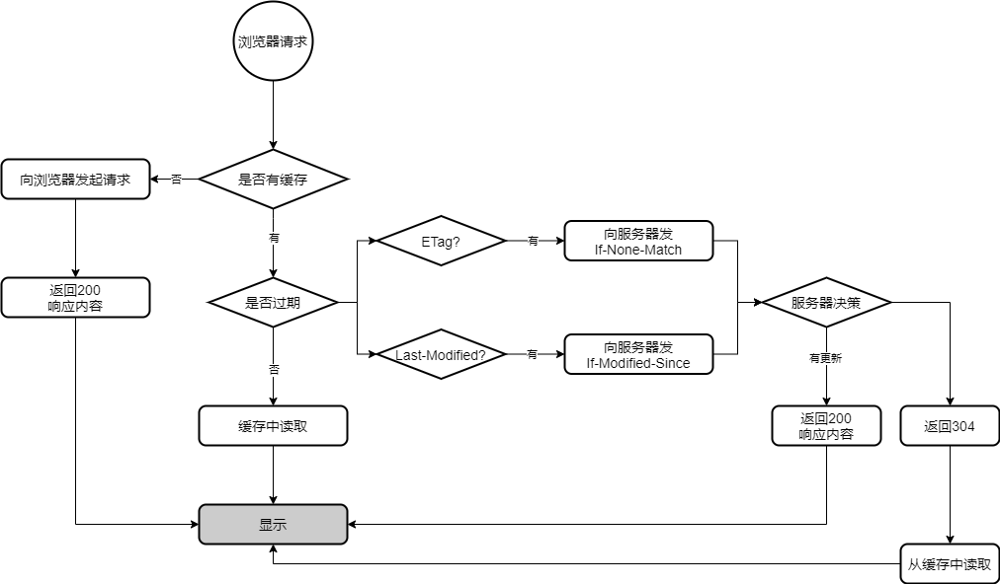
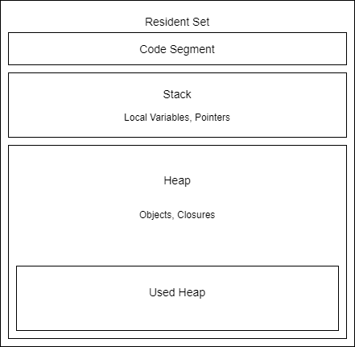

[TOC]

## 一、Node

### Node

Node的首要目标是提供一种简单的用于创建高性能服务器的开发工具

Web服务器的瓶颈在于并发的用户量，对比Java和Php的实现方式

- Node.js是一个基于Chrome V8引擎的JavaScript运行环境，让JS的执行效率与低端的C语言的相近的执行效率
- Node.js使用了一个事件驱动、非阻塞式I/O的模型，使其轻量又高效
- Node.js的包管理器npm是全球最大的开源库生态系统


### 单线程 非阻塞IO

1. 节约内存

2. 节约上下文切换时间

   （多线程并非同一时间点执行多个任务 而是通过快速切换时间片实现）

3.  锁的问题 并发资源的处理

浏览器UI线程 & JS线程共用一个线程

web worker 多线程

1. 完全受主线程控制

2. 不能操作DOM

   不改变JS单线程的本质
   
   

### 浏览器模型

### 任务队列

#### 事件循环（Event Loop）

1. 同步任务都在主线程上执行——执行栈
2. 异步任务有了运行结果 就在任务队列中放一个事件
3. 执行栈中同步任务执行完 读取任务队列 结束等待状态 进入执行栈执行


### 同步VS异步 阻塞VS非阻塞

同步异步取决于被调用者 阻塞非阻塞取决于调用者

**组合：**同步阻塞 / 异步阻塞 / 同步非阻塞 / 异步非阻塞

**同步和异步**

关注的是消息通知机制

同步：发出调用后 没有结果前不返回 一旦返回即为返回值

异步：发出调用后即返回 无返回结果 被调用者通过状态、通知或回调函数处理调用

**阻塞和非阻塞**

关注的是程序在等待调用结果（消息、返回值）时的状态

阻塞：调用结果返回前 当前线程被被挂起 只有在得到结果后才返回

非阻塞：不能立即得到结果前 该调用不会阻塞当前线程


## 二、REPL


## 三、NodeCore

### 1. ```console```对象

在Node.js中，用```console```对象代表控制台（在操作系统中表现为一个操作系统指定的字符界面，如Windows中的命令提示窗口cmd）

```javascript
// 把标准输出流输出到文件 1
console.log(1);
console.info(1);

// 错误输出 2
console.warn(2);
console.error(2);
    // 把错误输出2重定向到标准输出1中
    // node console.js 1>a.log 2>&1

// 用来统计两段代码之间的执行时间
console.time('cost');
let i = 0;
while(i++ < 10000000) {
    
}
console.timeEnd('cost'); // 输出时间差

// 断言
function sum(a, b) {
    return a + b;
}
console.assert(sum(1,2) == 3, '报错')；

// 列出对象的结构
console.dir(global);

// 跟踪当前代码的调用栈
console.trace();
```


### 2. ```global```对象

- global的变量都是全局变量
- 所有的全局变量都是global的属性

```javascript
// console
// argv
// process 当前进程
console.log(process);
// cwd: current working directory // chdir: change directory 改变当前工作目录
process.chdir('..');
console.log(process.cwd());
// memoryUsage
console.log(process.memoryUsage());
	// rss 常驻内存
    // heapTotal 堆内存的总申请量
    // heapUsed 已经使用的量
    // external 外部内存的使用率
    // V8引擎最大使用内存量是1.7G
// nextTick 把回调函数放在当前执行栈的底部
// setImmediate 把回调函数放在事件队列的尾部
function read() {
    setImmediate(function() {
        console.log(1);
        setImmediate(function() {
            console.log(2);
            process.nextTick(function() {
                console.log(0);
            })
            setImmediate(function() {
                console.log(3);
            })
        })
    })
}
read();
// stdout stderr stdin
// Buffer
// clearImmediate clearInterval clearTimeout
// setImmediate setInterval setTimeout
```

- ```nextTick```

```javascript
function Clock() {
    this.listener;
    
    process.nextTick(() => {this.listener();})
}

Clock.prototype.add = function(listener) {
    this.listener = listener;
}

let c = new Clock();
c.add(() => {console.log('ok')});
```


### 3. 函数


### 4. ```EventEmitter```

Node.js中用于实现各种事件处理的```event```模块中，定义了[```EventEmitter```类](EventEmitter.js)，可能触发事件的对象都是继承自```EventEmitter```类的子类实例对象

```javascript
var url = "http://mylogger.io/log";

const EventEmitter = require("events");

class Logger extends EventEmitter {
  log(message) {
    // Send an HTTP request
    console.log(message);

    // Raise an event
    this.emit("messageLogged", { id: 1, url: "http://" });
  }
}

module.exports = Logger;
```

```javascript
const EventEmitter = require("events");
const Logger = require("./logger");
const logger = new Logger();
// Register a listener
logger.on("messageLogged", (arg) => console.log(arg)); // e, eventArg
// Raise an event
logger.log("message");
```


### 5. ```util```

```javascript
let util = require('util');
let obj = {name:'', home:{city:{name:''}}};
console.log(obj);
console.log(util.inspect(obj, {depth:2}));
util.isUndefined();
```


### 6. os

```javascript
const os = require("os");
var total = os.totalmem();
var free = os.freemem();
```


### 7. npm

```
// 包更新
"^4.X.X"
"~4.1.X"
"4.1.1"

// 查看node_modules
npm list
npm list --depth=0

npm view mongoose dependencies
npm view mongoose versions

npm outdated
npm -g outdated
npm update
```


### 8. node断点调试

V8提供了强大的调试器，可以通过TCP协议从外部访问

Node.js提供了内建调试器，在代码中加入```debugger```标签，相当于在代码中开启一个断点

```node inspect```


## 四、Module

### 1. 模块发展

0. 命名空间 

1. 闭包 自执行函数
2. require.js AMD
3. sea.js CMD
4. node.js common.js
5. ES6  ES module
6. UMD: AMD + CMD + common.js + ES module

**JS模块化的不足**

- JS没有模块系统，不支持封闭的作用域和依赖管理
- 没有标准库，没有文件系统和IO流API
- 没有包管理系统

**common.js规范**

- 封装功能
- 封闭作用域
- 解决依赖问题
- 重构方便

#### 1.1 Node中的common.js

- 在Node.js中，模块划分所有功能，每个单独的文件都是一个```module```
- 通过```require```方法实现模块间的依赖管理         

**module.js**

```direname```取得当前模块文件的所有目录的绝对路径

```var args = [this.exports, require, this, filename, dirname]```

```// 当前模块的导出对象，require方法，当前模块，当前文件的绝对路径，当前文件夹的绝对路径```

在模块内部 ```this.exports```等于当前模块导出对象，就等于```this```

从模块外部访问模块内的成员：

- 使用exporrts对象
- 使用```module.exports```导出引用类型（可以导出对象或单一函数）

```javascript
// moduleName.js
let name = '';
let age = 22;

module.exports = {name, age};
```

```javascript
// usemodule.js
/**
在node.js中通过require方法加载其它模块，这个加载是同步的
1. 找到这个文件
2. 读取此文件模块的内容
3. 把它封装在一个函数里立刻执行
4. 执行后把模块的module.exports对象赋给属性moduleName
**/
let moduleName = require('./moduleName');

!function(exports, require, module, __filename, __dirname) {
    let name = '';
    let age = 22;
    
    module.exports = {name, age};
    return module.exports;
}
```

##### 模块对象

```javascript
Module {
  id: '.', // 模块ID 入口模块的ID永远为'.'
  path: 'C:\\dev\\CodeSutra\\notes\\nodejs',
  exports: {}, // 导出对象，默认为空
  parent: null, // 父模块
  filename: 'C:\\dev\\CodeSutra\\notes\\nodejs\\useModule.js',
  loaded: false, // 是否加载完成
  children: [], // 子模块
  paths: [
    'C:\\dev\\CodeSutra\\notes\\nodejs\\node_modules',
    'C:\\dev\\CodeSutra\\notes\\node_modules',
    'C:\\dev\\CodeSutra\\node_modules',
    'C:\\dev\\node_modules',
    'C:\\node_modules'
  ] // 第三方模块的查找路径
}
```

模块加载采用同步：因为模块实现缓存，当第一次加载一个模块之后，会缓存这个模块的exports对象，以后如果再次加载，则直接从缓存中取，不需要再次加载

```console.log(Object.keys(require.cache));```

缓存的key是绝对路径

```javascript
[Function: require] {
  resolve: [Function: resolve] { paths: [Function: paths] },
      // 只想知道模块路径，又不想加载该模块时
      // console.log(require.resolve('./moduleName'))
  main: Module {
    id: '.',
    path: 'C:\\dev\\CodeSutra\\notes\\nodejs',
    exports: {},
    parent: null,
    filename: 'C:\\dev\\CodeSutra\\notes\\nodejs\\useModule.js',
    loaded: false,
    children: [],
    paths: [
      'C:\\dev\\CodeSutra\\notes\\nodejs\\node_modules',
      'C:\\dev\\CodeSutra\\notes\\node_modules',
      'C:\\dev\\CodeSutra\\node_modules',
      'C:\\dev\\node_modules',
      'C:\\node_modules'
    ] // module.paths 当前模块的查找路径
  }, // 即入口模块
  extensions: [Object: null prototype] {
    '.js': [Function (anonymous)],
    '.json': [Function (anonymous)],
    '.node': [Function (anonymous)]
  }, 
      /** 
      在node里模块的类型有三种
      1. JS模块
      2. json模块
      let moduleName = require('./moduleName.json');
      先找文件，读取文件内容，JSON.parse转成对象返回
      3. node C++扩展二进制模块
      当require加载一个模块时，先找moduleName，再找moduleName.js，再找moduleName.json，再找moduleName.node
      **/
  cache: [Object: null prototype] {
    'C:\\dev\\CodeSutra\\notes\\nodejs\\useModule.js': Module {
      id: '.',
      path: 'C:\\dev\\CodeSutra\\notes\\nodejs',
      exports: {},
      parent: null,
      filename: 'C:\\dev\\CodeSutra\\notes\\nodejs\\useModule.js',
      loaded: false,
      children: [],
      paths: [Array]
    }
  }
}
```


### 2. 模块分类

1. **原生模块：**node内置的模块放在了node.exe里，加载最快

2. **文件模块：**在硬盘的某个位置，加载速度很慢，分为三种类型 ：

   - .js的JavaScript脚本文件，读入内存后运行
   - .json的JSON文件，fs读入内存转换为JSON对象
   - .node的经过编译后的二进制C/C++扩展模块文件，直接使用

   存放和加载的位置分为两种：

   - 自己写的，通过相对路径或绝对路径加载
   - 别人写的，通过名字调用，去node_modules里找

**第三方模块：**如果```require```函数只指定名称则视为从node_modules下面加载文件，这样可以移动模块而不用修改引用的模块路径

第三方模块的查询路径包括```modules.paths```（当前模块的查找路径）和全局目录

### 3. 模块的加载策略


#### 文件模块查找规则

```javascript
let load = require('./load');
/**
load->load.js->load.json->load.node
->load文件夹->package.json->"main"
->index(.js/node)
**/
// ---------------------------------------
let load = require('load');
// 当前模块的查找路径 全局的模块路径
// module.paths  global module
cosole.log(module.paths);
/**
[
  'C:\\dev\\CodeSutra\\notes\\nodejs\\node_modules',
  'C:\\dev\\CodeSutra\\notes\\node_modules',
  'C:\\dev\\CodeSutra\\node_modules',
  'C:\\dev\\node_modules',
  'C:\\node_modules'
  环境变量中的NODE_PATH指向的目录
] 
**/
```


## 五、Buffer 全局对象

缓冲区Buffer是暂时存放输入输出数据的一段内存

JS语言没有二进制数据类型，而在处理TCP和文件流的时候，必须要处理二进制数据，NodeJS提供了一个Buffer对象来**提供二进制数据的操作**，是一个**表示固定内存分配的全局对象**，也就是说要放到缓存区中的字节数需要提前确定

Buffer好比一个**由8位字节元素组成的数组**，可以有效地在JavaScript中表示二进制数据

[**字节、编码**](./encoding.md)

### Buffer常用方法

```javascript
// 分配一个长6个字节的Buffer
let buf0 = Buffer.alloc(6);
// 默认为0
let buf1 = Buffer.alloc(6, 2); 
// 分配一块没有初始化的内存
let buf2 = Buffer.allocUnsafe(60);
// 通过数组创建
let buf3 = Buffer.from([1, 2, 3]);
// 通过字符串创建
let buf4 = Buffer.from('玉面');

// 1填充值 2填充的开始索引 3结束索引
// buf.fill(value[, offset[, end]][,encoding])
buf0,fill(3, 1, 3);

// 1写的字符串 2填充的开始索引 3填充的字节长度 3编码
buf0.write('玉面', 0, 3, 'utf8');
buf0.write('面', 3, 3, 'utf8');

let buf5 = Buffer.alloc(6);
// 向指定的索引写入一个8位的整数，即占用一个字节的整数
buf5.writeInt8(0, 0);
buf5.writeInt8(16, 1);
buf5.writeInt8(32, 2);
console.log(buf5); // [0, 10, 20]

let buf6 = Buffer.alloc(4);
// BE:Big Endian 即高位在前 / LE:Little Endian 即低位在前
buf6.writeInt16BE(256, 0); // [01,00,00,00]
let s1 = buf6.readInt16LE(0); // 1
let s2 = buf6.readInt16BE(0); // 256
buf6.writeInt16LE(256, 2); // [01,00,00,01]

// console.log永远输出十进制
// Buffer永远输出16进制

// 把buffer转成字符串
// buf.toString([encoding[, start[, end]]])
console.log(buf6.toString());

// buf.slice([start[, end]])
let buf7 = buf5.slice(2, 6); // 浅拷贝

// string_decoder是为了解决乱码问题
let buf8 = Buffer.from('玉面小飞狐');
let buf9 = buf8.slice(0, 5);
let buf10 = buf8.slice(5, 7);
let buf11 = buf8.slice(7);
let {StringDecoder} = require('string_decoder');
let sd = new StringDecoder();
// write就是读取buffer的内容，返回一个字符串
// write时判断是否为一个字符，如果是就输出，不是则缓存在对象内部，等下次write时把之前缓存的字符加到write的buffer上再进行判断
console.log(sd.write(buf9)); // 玉
console.log(sd.write(buf10)); // 面
console.log(sd.write(buf11)); // 小飞狐
```


## 六、fs

Node.js中使用fs模块来**实现所有有关文件及目录的创建、写入及删除操作**

在fs模块中所有方法都分为同步和异步两种实现，具有```sync```后缀的方法为同步方法，不具有的为异步方法

### 1. 整体读取、写入文件

**异步读取**

```fs.readFile(path[, options], callback)```

options: 

- encoding
- flag 默认'r'

**同步读取**

```fs.readFileSync(path[, options]);```

**异步写入**

```fs.writeFile(file, data[, options], callback);```

options: 

- encoding
- flag 默认'w'
- mode 读写权限 默认0o666

**同步写入**

```fs.writeFileSync(file, data[, options]);```

**追加文件**

```fs.appendFile(file, data[, options], callback);```

```javascript
let fs = require('fs');
fs.readFile('', {encoding:'utf8', flag:'r'}, function(err, data){
    if(err){
        console.error(err);
    } else {
        // 移除BOM
        if(data[0] == 0xef && data[1] == 0xbb && data[2] == 0xbf) {
            data = data.silce(3);
        }
        console.log(data);
    }
});

// 666 linux 权限位
fs.writeFile('', 'data', {encoding:'utf8', flag:'a', mode:0o666}, function(err){
    console.log(err);
});

fs.appendFile('', 'data', function(err){
    console.log(err);
}); // 相当于writeFile flag='a'
```

### 2. 拷贝文件

[copy.js](./copy.js)

### 3. 从指定位置读取、写入文件

当文件特别大时，无法执行文件整体的操作，需要精确控制读取字节

**打开文件**

```fs.open(filename, flags, [mode], callback);```

**读取文件**

```fs.read(fd, buffer, offset, length, position, callback(err, bytesRead, buffer));```

**写入文件**

```fs.write(fd, buffer[, offset[, length[, position]]], callback);```

**关闭文件**

```fs.close(fd, callback);```

**同步磁盘缓存**

```fs.fsync(fd, [callback]);```

```javascript
fs.open('', 'r', 0o666, function(err, fd) {
    console.log(fd);
    let buff = Buffer.alloc(3);
    // fd, buffer, offset写入索引, length从文件中读取几个字节, position文件的读取位置=null表示当前位置, callback
    fs.read(fd, buff, 0, 3, null, function(err, bytesRead. buffer){
        console.log(buff.toString());
        let buff2 = Buffer.alloc(4);
        fs.read(fd, buff2, 0, 3, null, function(err, bytesRead. buffer){
        	console.log(buff2.toString());
    	});
    });
});
// fd: file discriptor 文件描述符
// 0 标准输入（键盘） 1 标准输出（屏幕） 2 错误输出
process.stdin.on('data', function(data){
    console.log(data);
}); // 标准输入
console.log('hello'); // 标准输出
// process.stdout.write('hello'); 
console.error('wrong'); // 错误输出
// process.stderr.write('wrong');

fs.open('', 'a', 0o666, function(err, fd) {
    console.log(fd);
    console.log(err);
    // 当我们调用write方法写入文件的时并不会直接写入物理文件 而是会先写入缓存区 再批量写入物理文件
    // fd, buffer, offset读取Buffer偏移量, length从文件中读取几个字节, position写入索引=null表示当前位置, callback
    fs.write(fd, Buffer.from('珠峰'), 0, 3, 3, function(err, bytesWritten){
        console.log(err);
        console.log(bytesWritten);
        // 强行把缓存区的数据写入文件并关闭
        fs.fsync(fd, function(err) {
            fs.close(fd, function() {
                console.log('关闭');
            });
        });
    });
});
```


### 4. 目录操作

**创建目录**

```fs.mkdir(path[, mode], callback); // 要求父目录必须存在```

**判断一个文件是否有权限访问**

```fs.access(path[, mode], callback);```

```javascript
let fs = require('fs');

// 创建目录时必须要求父目录是存在的
fs.mkdir('a/b', function(err) {
    console.log(err);
});

// 判断一个文件或目录是否存在 fs.exists
fs.access('a', fs.constants.R_OK, function(err) {
    console.log(err);
});
```

[**递归异步创建目录**](./mkdir.js)

**读取目录下所有文件**

```fs.readdir(path[, options], callback);```

**查看文件目录信息**

```fs.stat(path, callback);```

- ```stats.isFile();```
- ```stats.isDirectory();```
- ```atime(Access Time); // 上次被读取的时间```
- ```ctime(State Change Time); // 属性或内容上次被修改的时间```
- ```mtime(Modified time); // 档案的内容上次被修改的时间```

**移动文件或目录**

```fs.rename(oldPath, newPath, callback);```

```javascript
let fs = require('fs');

fs.readdir('', function(err, files){
    console.log(files);
    files.forEach(file => {
        let child = path.join('', file);
        fs.stat(child, function(err, stat) {
            console.log(stat);
        });
    });
});
```

[**递归删除非空目录**](./rmdirp.js)

**遍历算法**

目录是一个树状结构，在遍历时一般使用[**深度优先+先序遍历**](./PreDeep.js)算法，深度优先意味着到达一个节点后首先接着遍历子节点而不是邻居节点；先序遍历意味着首次到达了某节点就算遍历完成，而不是最后一次返回某节点才算数

**监视文件或目录**

```fs.watchFile(filename[, options], listener);```

```javascript
let fs = require('fs');
// 当文件发生变化之后执行对应回调函数
fs.watchFile('', function(newStat, prevStat) {
    console.log(Date.parse(prevStat.ctime));
    if(Date.parse(prevStat.ctime) == 0) {
        console.log('新增加的文件');
    } else if(Date.parse(prevStat.ctime) != Date.parse(newStat.ctime)) {
        console.log('文件被修改了');
    } else {
        console.log('删除了')；
    }
});
```

#### path

```javascript
let path = require('path');

// 解析目录
let pathObj = path.parse(__filename); // { root, dir, base, ext, name }

// 连接两个目录
path.join('a', 'b');

/* 从当前路径出发解析出一个绝对路径
.. 代表上一级目录
. 代表当前目录
字符串 代表当前目录下的子目录 */
path.resolve('..', '.', 'a');

/* 环境变量分隔符
因为在不同的操作系统 分隔符不同
window ; mac linux : */
path.delimiter;

// 文件路径分隔符
path.sep;
path.win32.sep;
path.posix.sep;

// 获取两个路径之间的相对路径
path.relative;

// 获取文件名
path.basename('aa.jpg'); // aa.jpg
path.basename('aa.jpg', 'jpg'); // aa
// 获取文件扩展名
path.extname('aa.jpg'); // jpg
```


## 七、stream

流是一组有序的，有起点和终点的字节数据传输手段

它不关心文件的整体内容，只关注是否从文件中读到了数据，以及读到数据之后的处理

流是一个抽象接口，被Node中的很多对象所实现，比如HTTP服务器request和response对象都是流

### 1. 四种基本流类型

Node.js中有四种基本的流类型

- Readable - 可读的流（如 ```fs.createReadStream()```）
- Writable - 可写的流（如 ```fs.createWriteStream()```）
- Duplex - 可读写的流（如 ```net.Socket```）
- Transform - 在读写过程中可以修改和变换数据的Duplex（如 ```zlib.createDeflate()```）

**流中的数据有两种模式，二进制模式和对象模式**

- 二进制模式 每个分块都是buffer或string对象
- 对象模式 流内部处理的是一系列普通对象


### 2. 可读流createReadStream

实现了```stream.Readable```接口的对象，将对象数据读取为流数据，当监听data事件后开始发射数据

#### 2.1 创建可读流、可读流方法

```let rs = fs.createReadStream(path, [options]);```

options:

- flags 打开文件要做的操作，默认为'r'
- encoding 默认为null
- start 开始读取的索引位置
- end 结束读取的索引位置（包括结束位置）
- highWaterMark 读取缓存区默认的大小64kb 如果指定utf8编码highWaterMark要大于3个字节

```javascript
let fs = require('fs');
// 创建一个可读流
let rs = fs.createReadStream('', {highWaterMark:3}); // highWaterMark缓冲区大小 最高水位线
rs.on('open', function() {
    console.log('文件打开');
});
// 监听它的data事件，一旦开始监听，流就可以读文件的内容并发射data
// 默认情况下，监听data事件后会不停读数据，然后触发data事件，触发完后再次读数据
// 希望流有一个暂停和恢复触发的机制
rs.on('data', function(data) {
    console.log(data);
    rs.pause(); // 暂停读取和发射data事件
    setTimeout(function() {
        rs.resume(); // 恢复读取并触发data事件
    }, 2000);
});
rs.on('error', function() {
    console.log('error');
}); // 出错时触发error事件
rs.on('end', function() {
    console.log('读完了');
}); // 读完了触发end事件
rs.on('close', function() {
    console.log('文件关闭');
});
```

#### 2.2 可读流的两种模式

可读流工作在两种模式之一：**flowing**和**paused**

- flowing模式下，可读流自动从系统底层读取数据，并通过EventEmitter接口的事件尽快将数据提供给应用（打开阀门的水龙头）

  > 流动模式不缓存，直接发射，然后读取下次的数据

- paused模式下，必须显式调用```stream.read()```方法来从流中读取数据片段（吸管自己吸）

所有初试工作模式为paused的Readable流，可以通过三种途径切换到flowing模式：

- 监听 'data' 事件
- 调用 ```stream.resume()```方法
- 调用 ```stream.pipe()```方法将数据发送到 Writable

> 如果Readable切换到flowing模式，且没有消费者处理流中的数据，这些数据将会丢失，比如调用了```readable.resume()```方法却没有监听 'data' 事件，或是取消了 'data' 事件监听，就有可能出现这种情况

可读流切换到paused模式：

- 如果不存在管道目标（pipe destination），可以通过调用 ```stream.pause()``` 方法实现
- 如果存在管道目标，可以通过取消 'data' 事件监听，并调用 ```stream.unpipe()``` 方法移除所有管道目标来实现

#### 2.3 缓存区

Writable和Readable流都会将数据存储到内部的缓冲器（buffer）中，链表结构，通过```readable.readableState.buffer```来获取

```javascript
let fs = require('fs');
let rs = fs.createReadStream('', {highWaterMark:3});
// 当监听readable事件时，会进入暂停模式
// 当监听readable事件时，可读流会马上去向底层读取文件，然后把读到的文件放在缓存区里
// const state = this._readableState
// self.read(0); // 只填充缓存，不会发射data事件，但会发射stream.emit('readable')事件
rs.on('readable', function(data){
    // state.length += chunk.length; ==3 
    console.log(rs._readableState.length); // 缓存区数据大小
    // read如果不加参数表示读取整个缓存区数据
    // 如果可读流发现要读的字节小于等于缓存字节大小，则直接返回
    let ch = rs.read(1);
    console.log(ch);
    console.log(rs._readableState.length); // 2
    // 当读完指定字节后，可读流发现剩下的字节比最高水位线小，则会立马再次读取填满最高水位线
    setTimeout(function() {
        console.log(rs._readableState.length);
    },200); // 5 
    // 最高水位线是3 缓存区大小没有限制
    // this.buffer = new BufferList();
});
```

#### 2.4 [手写一个可读流ReadStream](./ReadStream.js)

[read](./read.js)


### 3. 可写流createWriteStream

往可写流中写数据时，不会立刻写入文件，而是先写入缓存区，缓存区大小就是```highWaterMark```，默认值为16K

```javascript
let fs = require('fs');
let ws = fs.createWriteStream('', {
    flags:'w',
    mode:0o666,
    start:0,
    highWaterMark:3
});
// 如果缓存区已满，返回false 未满，返回true
// 如果能接着写，返回true 不能接着写，返回false
// 如果返回false后依然继续写，会缓存在内存里，等缓存区清空后再从内存里读出来
```

**end方法**

```ws.end(chunk, [encoding], [callback]);```

> 表明接下来没有数据要被写入 通过传入可选的chunk和encoding参数，可以在关闭流之前再写入一段数据
>
> callback函数将作为 'finish' 事件的回调函数

**drain方法**

当流不处在drain的状态，对```write()```的调用会缓存数据块，并返回false

一旦所有当前所有缓存的数据块都排空了（被操作系统接受来进行输出），那么```drain```事件就会被触发

建议，一旦```write()```返回false，在```drain```事件触发前，不能写入任何数据块

**finish方法**

在调用了```stream.end()```方法，且缓冲区数据都已经传给底层系统之后，'finish'事件将被触发

```javascript
let writer = fs.createWriteStream('');
for(let i = 0; i < 100; i++) {
    writer.write(`hello, ${i}!\n`);
}
writer.end('结束\n');
writer.on(`finish`, () => {
    console.error('所有写入已经完成！');
});
```

#### [手写一个可写流WriteStream](./WriteStream.js)

[write](./write.js)


### 4. pipe方法

**pipe原理**

```javascript
// linux经典的管道的概念 前者的输出是后者的输入
let fs = require('fs');
let rs = fs.createReadStream('', {highWaterMark:3});
let ws = fs.createWriteStream('', {highWaterMark:3});

// rs.pipe(ws);
// rs.unpipe(ws);

// 监听可读流data事件时会触发回调函数的执行，可以实现数据的生产者和消费者速度的均衡
rs.on('data', function(data){
    console.log(data);
    let flag = ws.write(data);
    if(!flag){
        rs.pause();
    }
});
// 监听可写流缓存区清空事件，当所有要写入的数据写入完成后，接着恢复从可读流里读取并触发data事件
ws.on('drain', function(){
    console.log('drain');
    rs.resume();
});

rs.on('end', function(){
    ws.end();
});
```

**pipe用法**

```javascript
readStream.pipe(writeStream);
let from = fs.createReadStream('');
let to = fs.createWriteStream('');
from.pipe(to);
```

> 将数据的滞留量限制到一个可接受的水平，以使得不同速度的来源和目标不会淹没可用内存

**unpipe方法**

```readable.unpipe()```方法将之前通过```stream.pipe()```方法绑定的流分离

如果```destination```没有传入，则所有绑定的流都会被分离


### 5. 流的经典应用 - 行读取器

以前的打印每秒可以打印10个字符，换行符需要0.2秒，正好可以打印2个字符

于是研制人员在每行后加两个表示结束的字符：“字符”、“回车”

- Unix系统里，每行结尾只有<换行>（line feed），即"\n"
- Windows系统里，<回车><换行>，即"\r\n"
- Mac系统里，<回车>，即"\r"

在ASCII码里，

换行 \n 10 0A

回车 \r 13 0D

[行读取器](./LineReader.js)


## 八、TCP

在Node.js中，提供了net模块用来实现TCP服务器和客户端的通信

### 1. TCP服务器

[创建一个服务器，监听客户端的连接，当客户端连接上来之后执行监听函数](./tcpip/tcpserver.js)

[当客户端访问服务器时，服务器会发给客户端一个文件（socket）](./tcpip/socket.js)

[pause & resume](./tcpip/server.js)

### 2. TCP客户端

[client](./tcpip/client.js)

### 3. [聊天室](./tcpip/chatServer.js)


## 九、UDP

### 1. [udpServer](tcpip/udpServer.js) & [udpClient](./tcpip/udpClient.js)

### 2. 组播

把该socket端口对象添加到组播组中  *QQ群*

```javascript
socket.addMembership(multicastAddress, [multicastInterface]); // 进群
```

```muticastAddress```必须指定，需要加入的组播组地址

```javascript
socket.dropMembership(multicastAddress, [multicastInterface]); // 退群
socket.setMulticastTTL(ttl); // 最长传播时间
socket.setMulticastLoopback(flag); // 是否回环
```

#### 服务器

```javascript
let dgram = require('dgram');
let server = dgram.createSocket('udp4');

server.on('listening', function() {
    server.MulticastTTL(128);
    server.setMulticastLoopback(true);
    server.addMembership('230.185.192.108');
});

setInterval(broadcast, 1000);
function broadcast() {
    let buffer = Buffer.from(new Date().toLocalString());
    server.send(buffer, 0, buffer.length, 8080, '230.185.192.108');
}
```

#### 客户端

```javascript
let dgram = require('dgram');
let client = dgram.createSocket('udp4');

client.on('listening', function() {
    client.addMembership('230.185.192.108');
});

client.on('message', function(message, remote) {
    console.log(message.toString());
});

client.bind(8080, '192.168.1.103');
```


## 十、HTTP

HTTP全称是超文本传输协议，构建于TCP之上，属于应用层协议

### 1. HTTP服务器

[创建http服务器](./http/server.js)

[向客户端写入响应信息](./http/response.js)

[模拟parser方法](http/parser.js)

[模拟http服务器](http/httpServer.js)

### 2. HTTP客户端

[http服务器](http/http.js)

[http客户端（爬虫）](http/client.js)

### 3. 静态文件服务器

#### 3.1 ```zlib```压缩

Node中可以使用```zlib```模块进行压缩和解压缩处理，压缩文件以后可以减少体积，加快传输速度和节约带宽代码

压缩和解压缩对象都是一个可读可写流

| 方法 | 说明 |
| ---- | ---- |
|```zlib.createGzip``` |返回```Gzip```流对象，使用Gzip算法对数据进行压缩处理|
|```zlib.createGunzip``` |返回```Gzip```流对象，使用Gzip算法对压缩数据进行解压缩处理|
|```zlib.createDeflate``` |返回```Deflate```流对象，使用Deflate算法对数据进行压缩处理|
|```zlib.createInflate``` |返回```Deflate```流对象，使用Deflate算法对压缩数据进行解压缩处理|

[压缩和解压缩](./静态文件服务器/gzip.js)

[在http服务器中的应用](./静态文件服务器/server.js)

#### 3.2 ```crypto```加密

```crypto``` 是node.js中实现加密和解密的模块 使用 ```OpenSSL``` 类库作为内部实现加密解密的手段 ```OpenSSL``` 是一个经过严格测试的可靠的加密与解密算法的实现工具

##### 3.2.1 散列（哈希）算法

散列算法也叫哈希算法，用来把任意长度的输入变换成固定长度的输出，常见的有md5、sha1等

- 相同的输入会产生相同的输出
- 不同的输出会产生不同的输出
- 任意的输入长度输出长度的相同的
- 不能从输出推算出输入的值

[md5加密摘要](./server/crypto/md5.js)

[http服务器中应用](server/crypto/app.js)

##### 3.2.2 HMAC算法

HMAC算法将散列算法与一个密钥结合在一起，以阻止对签名完整性的破坏

**生成私钥**

```key``` 为一个字符串，用于指定一个PEM格式的密钥

PEM是OpenSSL的标准格式，OpenSSL使用PEM文件格式存储证书和密钥，是基于Base64编码的证书

```$ openssl genrsa -out rsa_private.key 1024```

[hmac加密摘要](server/crypto/hmac.js)

##### 3.2.3 对称加密

blowfish 算法是一种对称的加密算法，加密和解密使用的是同一个密钥

[对称加密和解密](server/crypto/ciper.js)

#### 3.3 ```yargs```

#### 3.4 缓存

##### 3.4.1 缓存作用

- 减少冗余的数据传输，节省网费
- 减少服务器的负担，大大提高网站性能
- 加快了客户端加载网页的速度

##### 3.4.2 缓存分类

- 强制缓存 如果生效，不需要再和服务器发生交互

- 对比缓存 不管是否生效，都需要与服务器端发生交互

  两类缓存规则可以同时存在，强制缓存优先级高于对比缓存

###### 3.4.2.1 强制缓存

强制缓存，在缓存数据未失效的情况下，可以直接使用缓存数据

在没有缓存数据时，浏览器向服务器请求数据时，服务器会将数据和缓存规则一并返回，缓存规则信息包含在响应header中


###### 3.4.2.2 对比缓存

对比缓存，需要进行比较判断是否可以使用缓存

浏览器第一次请求数据时，服务器会将缓存标识与数据一起返回给客户端，客户端将二者备份至缓存数据库中

再次请求数据时，客户端将备份的缓存标识发送给服务器，服务器根据缓存标识进行判断，判断成功后，返状态码，通知客户端比较成功，可以使用缓存数据

##### 3.4.3 请求流程

**第一次请求**

浏览器请求 -> 无缓存 -> 向web服务器请求 -> 请求响应，缓存协商 -> 呈现

缓存协商：是否缓存Expires / Cache-Control、缓存时间、Etag、Last-Modified等

**第二次请求**



##### 3.4.4 最后修改时间

**通过最后修改时间来判断缓存是否可用**

1. ```Last-Modified```：响应时告诉客户端此资源的最后修改时间
2. ```If-Modified-Since```：当资源过期时（使用Cache-Control标识的max-age），发现资源具有```Last-Modified```声明，则再次向服务器请求时带上头```If-Modified-Since```
3. 服务器收到请求后发现有头```If-Modified-Since```则与被请求资源的最后修改时间进行比对，若最后修改时间较新，说明资源又被改动过，则响应最新的资源内容并返回200状态码
4. 若最后修改时间和```If-Modified-Since```一样，说明资源没有修改，则响应304表示未更新，告知浏览器继续使用所保存的缓存文件

[最后修改时间](server/cache/lastmodify.js)

**存在的问题**

- 某些服务器不能精确得到文件的最后修改时间，这样就无法通过最后修改时间来判断文件是否更新了
- 某些文件的修改非常频繁，在秒一下的时间内进行修改，而```Last-Modified```只能精确到秒
- 一些文件的最后修改时间改变了，但是内容并未改变，不希望客户端认为这个文件修改了
- 如果同样的一个文件位于多个CDN服务器上的时候内容虽然一样，修改事件不一样

##### 3.4.5 ETag

ETag是实体标签的缩写，根据实体内容生成的一段```hash```字符串，可以标识资源的状态，当资源发生变化时，ETag也随之发生变化

ETag是Web服务端产生的，发给浏览器客户端

1. 客户端想判断缓存是否可用，可以先获取缓存中文档的ETag，然后通过```If-None-Match```发送请求给Web服务器询问此缓存是否可用
2. 服务器收到请求，将服务器中此文件的ETag和请求头中的```If-None-Match```相比较，如果值是一样的，说明缓存还是最新的，Web服务器将发送```304 Not Modified```响应码给客户端表示缓存未修改过，可以使用
3. 如果不一样，则Web服务器将发送该文档的最新版本给浏览器客户端

[ETag](server/cache/etag.js)

##### 3.4.6 Cache-Control

浏览器将文件缓存到Cache目录，第二次请求时浏览器会先检查Cache目录下是否含有该文件，如果有并且还没到```Expires```设置的时间，即文件还没有过期，此时浏览器将直接从缓存目录中读取文件，不再发送请求

**Expires**是服务器响应消息头字段，在响应http请求时告诉浏览器在过期时间前可以直接从浏览器缓存数据，而无需再次请求，这是HTTP1.0的内容，现在浏览器均默认使用HTTP1.0，所以基本可以忽略

**Cache-Control**与```Expires```的作用一致，都是指明当前资源的有效期，控制浏览器是否直接从缓存取数据还是重新给服务器发请求取数据，优先级高于```Expires```

> private 客户端可以缓存
>
> public 客户端和代理服务器都可以缓存
>
> max-age=60 缓存内容将在60秒后失效
>
> no-cache 需要使用对比缓存验证数据，强制向源服务器再次验证（禁用强制缓存 代理服务器）
>
> no-store 所有内容都不会缓存，强制缓存和对比缓存都不会触发

[expires](server/cache/expires.js)

### 4.

#### 多语言切换

可以通过Accept-Language检测浏览器的语言

- 请求头格式 Accept-Language:zh-CN,zh;q=0.9,en;q=0.8,jp;q=0.7
- 响应头格式 Content-Language:zh-CN


#### 图片防盗链

从一个网站跳转，或者网页引用到某个资源文件时，HTTP请求中带有Referer表示来源网页的URL

通过检查请求头中的Referer来判断来源网页的域名

如果来源域名不在白名单内，则返回错误提示

用浏览器直接访问图片地址是没有Referer的


#### 代理服务器

代理（Proxy）也称网络代理，是一种特殊的网络服务，允许一个网络终端（一般为客户端）通过这个服务与另一个网络终端（一般为服务器）进行非直接的连接

一些网关、路由器等网络设备具备网络代理功能，一般认为代理服务有利于保障网络终端的隐私或安全，防止攻击

```
npm install http-proxy --save
```

- web 代理普通的HTTP请求
- listen pot
- close 关闭内置的服务


#### 虚拟主机

通过Host实现多个网站共用一个端口，多个网站共用一个服务器


#### User-Agent

User-Agent用户代理，简称UA，是一个特殊字符串头，使得服务器能够识别客户使用的操作系统及版本、CPU类型、浏览器及版本、浏览器渲染引擎、浏览器语言、浏览器插件等

```
npm i user-agent-parser -S
```


## 十一、进程

在Node.js中每个应用程序都是一个进程类的实例对象

使用```process```对象代表应用程序，这是一个全局对象，可以通过它来获取Node.js应用程序以及运行该程序的用户、环境等各种信息的属性、方法和事件

### 1. ```process```进程

#### 进程对象属性、方法、事件

```javascript
const port = process.env.PORT || 3000;
```

```javascript
console.log(`NODE_ENV: ${process.env.NODE_ENV}`);
console.log(`app: ${app.get('env')}`);

export NODE_ENV=production
```


**memoryUsage()**

```javascript
/**
 * process.memoryUsage()
 */

let s = process.memoryUsage();
console.log(s);
let buf = Buffer.alloc(1024 * 1024 * 1024);
/**
 * node v8引擎内存使用量是有上限的，32位里最多是.7G  64位最多是1.7G
 *
  rss: 21110784,
  heapTotal: 7159808,
  heapUsed: 4351880,
  external: 8224 } buffer的内存是单独分配的，属于external
 */
s = process.memoryUsage();
//console.log(s);
```

- rss ( resident set size )：所有内存占用，包括指令区和堆栈
- heapTotal：“堆”占用的内存，包括用到的和没用到的
- heapUsed：用到的堆的部分
- external：V8引擎内部的C++对象占用的内存



### 2. ```child_process```子进程

在Node.js中，只有一个线程执行所有操作，如果某个操作需要大量消耗CPU资源的情况下，后续操作都需要等待，且造成现代计算机的多核浪费

Node.js中提供了```child_process```模块，通过它可以开启多个子进程，在多个子进程之间可以共享内存空间，可以通过子进程的互相通信来实现信息的交换

#### 2.1 ```spawn()```

[spawn()](process/spawn.js)

[detached](process/detach.js)

#### 2.2 ```fork()```

[fork](process/fork.js)

[子进程与父进程共享HTTP服务器](process/server.js)

[子进程与父进程共享socket对象](process/socket.js)


