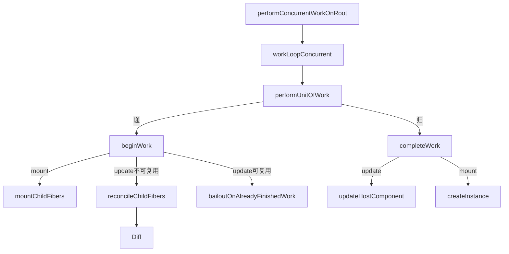

## React理念

### 快速响应 | 异步更新

关键是实现**快速响应**，制约因素：

#### CPU瓶颈

当遇到大计算量的操作或者设备性能不足使页面掉帧，导致卡顿

主流浏览器刷新频率为60Hz，即每（1000ms / 60Hz）16.6ms浏览器刷新一次

JS可以操作DOM，<u>GUI渲染线程与JS线程是互斥的，所以JS脚本执行和浏览器布局、绘制不能同时执行</u>

每16.6ms时间内，需要完成如下工作：

```text
JS脚本执行 -----  样式布局 ----- 样式绘制
```

当JS执行时间过长，超出了16.6ms，这次刷新就没有时间执行样式布局和样式绘制了，从而页面掉帧，造成卡顿

**解决**：

在浏览器每一帧的时间中，预留一些时间给JS线程，`React`利用这部分时间更新组件（在源码中，预留的初始时间是5ms）

当预留的时间不够用时，`React`将线程控制权交还给浏览器使其有时间渲染UI，`React`则等待下一帧时间到来继续被中断的工作。

> 这种将长任务分拆到每一帧中，像蚂蚁搬家一样一次执行一小段任务的操作，被称为**时间切片**（time slice）
>
> 开启`Concurrent Mode`：启用时间切片
>
> ```javascript
> // 通过使用ReactDOM.unstable_createRoot开启Concurrent Mode
> // ReactDOM.render(<App/>, rootEl);  
> ReactDOM.unstable_createRoot(rootEl).render(<App/>);
> ```

#### IO瓶颈

发送网络请求后，由于需要等待数据返回才能进一步操作导致不能快速响应

**解决**：

在网络延迟客观存在的情况下，减少用户对网络延迟的感知：[将人机交互研究的结果整合到真实的 UI 中 (opens new window)](https://zh-hans.reactjs.org/docs/concurrent-mode-intro.html#putting-research-into-production)

点击后，先在当前页面停留了一小段时间，这一小段时间被用来请求数据，当“这一小段时间”足够短时，用户是无感知的；如果请求时间超过一个范围，再显示`loading`的效果

为此`React`实现了Suspense功能及配套的`hook`——`useDeferredValue` 

在源码内部，为了支持这些特性，同样需要将同步的更新**变为**可中断的异步更新

落实到实现上，则需要将同步的更新变为**可中断的异步更新**


### React15

- Reconciler（协调器）—— 负责找出变化的组件

  在`React`中可以通过`this.setState`、`this.forceUpdate`、`ReactDOM.render`等API触发更新，Reconciler工作：

  - 调用函数组件 / 类组件的`render`方法，JSX—>虚拟DOM
  - 虚拟DOM和上次更新时的虚拟DOM对比
  - 找出本次更新中变化的虚拟DOM
  - 通知Renderer将变化的虚拟DOM渲染到页面上

- Renderer（渲染器）—— 负责将变化的组件渲染到页面上

Reconciler中，`mount`的组件会调用`mountComponent`，`update`的组件会调用`updateComponent`，这两个方法都会**递归**更新子组件

由于递归执行，所以更新一旦开始，中途就无法中断；当层级很深时，递归更新时间超过了16ms，用户交互就会卡顿

Reconciler和Renderer是**交替**工作的

### React16架构

- **Scheduler（调度器）**—— 调度任务的优先级，高优任务优先进入Reconciler

  需要一种机制，当浏览器有剩余时间时通知我们——`requestIdleCallback`polyfill：<u>空闲时触发回调、多种调度优先级供任务设置</u>

  接收到更新后，若没有其他高优更新，将任务交给Reconciler

- **Reconciler（协调器）**—— 负责找出变化的组件 —— 内部**`Fiber`**架构

  更新工作从递归变成了可以中断的循环过程，每次循环都会调用`shouldYield`判断当前是否有剩余时间

  ```javascript
  function workLoopConcurrent(){}
  ```

  Reconciler会为变化的虚拟DOM<u>打上代表增/删/更新的[标记](ReactFiberFlags.js)</u>

整个Scheduler与Reconciler的工作都在内存中进行，只有当所有组件都完成Reconciler的工作，才会统一交给Renderer

Scheduler和Reconciler的工作可能由于有其他更高优任务需要先更新或当前帧没有剩余时间被**中断**，由于都在内存中进行，不会更新页面上的DOM，所以即使反复中断，用户也不会看见更新不完全的DOM

- **Renderer（渲染器）**—— 负责将变化的组件渲染到页面上

  Renderer根据Reconciler为虚拟DOM打的标记，**同步**执行对应的DOM操作

  > 浏览器环境渲染的Renderer —— [ReactDOM (opens new window)](https://www.npmjs.com/package/react-dom)。
  >
  > 除此之外，还有：
  >
  > [ReactNative (opens new window)](https://www.npmjs.com/package/react-native)渲染器，渲染App原生组件；
  >
  > [ReactTest (opens new window)](https://www.npmjs.com/package/react-test-Renderer)渲染器，渲染出纯`Js`对象用于测试；
  >
  > [ReactArt (opens new window)](https://www.npmjs.com/package/react-art)渲染器，渲染到Canvas, SVG 或 VML (IE8)


### Reconciler `Fiber`架构

#### 代数效应

代数效应是函数式编程中的一个概念，用于将副作用从函数调用中分离，使函数关注点保持纯粹

- `async await`是有传染性的 —— 当一个函数变为`async`后，这意味着调用他的函数也需要是`async`，这破坏了原函数的同步特性
- 类似`async`，`Generator`也是传染性的，使用了`Generator`则上下文的其他函数也需要作出改变；`Generator`执行的中间状态是上下文关联的

应用：Hooks

> 对于类似`useState`、`useReducer`、`useRef`这样的`Hook`，我们不需要关注`FunctionComponent`的`state`在`Hook`中是如何保存的，`React`会为我们处理，我们只需要假设`useState`返回的是我们想要的`state`

#### `Fiber`

`Fiber`是计算机术语中的纤程，与进程（Process）、线程（Thread）、协程（Coroutine）同为程序执行过程

在很多文章中将纤程理解为协程的一种实现；在`JS`中，协程的实现便是`Generator`

所以，我们可以将纤程(`Fiber`)、协程(Generator)理解为代数效应思想在`JS`中的体现

**`React Fiber`**

##### 起源

曾经用于递归更新的<u>虚拟DOM</u>数据结构已经无法满足异步的可中断更新的需要

##### 含义

- 作为<u>架构</u>来说，之前`React15`的`Reconciler`采用递归的方式执行，数据保存在递归调用栈中，所以被称为`stack Reconciler`；`React16`的`Reconciler`基于`Fiber节点`实现，被称为`Fiber Reconciler`，是`React`内部实现的一套**状态更新机制**，支持任务不同优先级，可中断与恢复，并且恢复后可以复用之前的中间状态
- 作为<u>静态的数据结构</u>来说，每个`Fiber`节点对应一个`React element`，保存了该组件的类型（函数组件/类组件/原生组件...）、对应的DOM节点等信息
- 作为<u>动态的工作单元</u>来说，`React Element`对应的`Fiber`节点为每个**任务更新单元**，保存了本次更新中该组件改变的状态、要执行的工作（需要被删除/被插入页面中/被更新...）

##### [结构](ReactFiber.new.js)

```javascript
function FiberNode(){}
```

##### 工作原理

`React`使用“**双缓存**”来完成`Fiber`树的构建与替换——对应着`DOM`树的创建与更新

在`React`中<u>最多</u>会同时存在两棵`Fiber树`（触发更新时）：当前屏幕上显示内容对应的`Fiber树`称为**`current Fiber树`**，正在内存中构建的`Fiber树`称为**`workInProgress Fiber树`**

`current Fiber树`中的`Fiber节点`被称为`current fiber`，`workInProgress Fiber树`中的`Fiber节点`被称为`workInProgress fiber`，他们通过**`alternate`**属性连接

```javascript
currentFiber.alternate === workInProgressFiber;
workInProgressFiber.alternate === currentFiber;
```

`React`应用的**根节点`fiberRoot`**通过**`current`指针**在不同`Fiber树`的`rootFiber`间切换来实现`Fiber树`的切换：当`workInProgress Fiber树`构建完成交给`Renderer`渲染在页面上后，应用根节点的`current`指针指向`workInProgress Fiber树`，此时`workInProgress Fiber树`就变为`current Fiber树`；每次<u>状态更新</u>都会产生新的`workInProgress Fiber树`，通过`current`与`workInProgress`的替换，完成`DOM`更新

###### 组件mount时

1. 首次执行**`ReactDOM.render`**会创建`fiberRoot`和`rootFiber`，其中`fiberRoot`是整个应用的根节点（唯一），`rootFiber`是组件树的根节点（可以有多个）

   ```javascript 
   fiberRoot.current = rootFiber;
   ```

   由于是首屏渲染，页面中还没有挂载任何`DOM`，所以`fiberRoot.current`指向的`rootFiber`没有任何`子Fiber节点`（即`current Fiber树`为空）

2. 进入**render阶段**，根据组件返回的`JSX`在内存中依次创建`Fiber节点`并连接在一起构建`Fiber树`，被称为`workInProgress Fiber树`

   > 在构建`workInProgress Fiber树`时会尝试复用`current Fiber树`中已有的`Fiber节点`内的属性，在首屏渲染时只有`rootFiber`存在对应的`current fiber`（即`rootFiber.alternate`）

3. **commit阶段**将构建完的`workInProgress Fiber树`渲染到页面，`fiberRoot`的`current`指针指向`workInProgress Fiber树`使其变为`current Fiber 树`

###### 组件update时

1. 触发更新会开启一次新的**render阶段**并构建一棵新的`workInProgress Fiber树`
2. `workInProgress Fiber 树`在`render阶段`完成构建后进入**commit阶段**渲染到页面上，渲染完毕后，`workInProgress Fiber 树`变为`current Fiber 树`

### JSX

在React16中，`JSX`在编译时会被`Babel`编译为`React.createElement`方法（最终会调用`ReactElement`方法返回一个包含组件数据的对象，该对象有个参数`$$typeof: REACT_ELEMENT_TYPE`标记了该对象是个`React Element`，即在`React`中，所有`JSX`在运行时的返回结果（`React.createElement()`的返回值）都是`React Element`）

React17会自动引入新的入口函数调用，会自动将`JSX`替换为`Fiber节点`

> `ClassComponent`对应的`Element`的`type`字段为`AppClass`自身；`FunctionComponent`对应的`Element`的`type`字段为`AppFunc`自身
>
> ```javascript
> AppClass instanceof Function === true;
> AppFunc instanceof Function === true;
> ```
>
> 法通过引用类型区分`ClassComponent`和`FunctionComponent`，`React`通过`ClassComponent`实例原型上的`isReactComponent`变量判断是否是`ClassComponent`
>
> ```js
> ClassComponent.prototype.isReactComponent = {};
> ```

`JSX`是一种描述当前组件内容的数据结构，不包含组件schedule、reconcile、render所需的相关信息（如组件在更新中的优先级、组件的`state`、组件被打上的用于Renderer的标记），所以在组件`mount`时，Reconciler根据`JSX`描述的组件内容生成组件对应的`Fiber节点`；在`update`时，Reconciler将`JSX`与`Fiber节点`保存的数据对比，生成组件对应的`Fiber节点`，并根据对比结果为`Fiber节点`打上标记


## React架构

`Fiber节点`是如何被创建并构建`Fiber树`的

### render阶段



`Fiber Reconciler`是从`Stack Reconciler`重构而来，通过遍历的方式实现可中断的递归，所以`performUnitOfWork`的工作可以分为两部分：“递”和“归”

#### “递”和“归”

**递**

首先从`rootFiber`开始向下深度优先遍历，为遍历到的每个`Fiber节点`调用**`beginWork`**

该方法会根据传入的`Fiber节点`创建`子Fiber节点`，并将这两个`Fiber节点`连接起来

当遍历到叶子节点（即没有子组件的组件）时就会进入“归”阶段

**归**

在“归”阶段会调用**`completeWork`**处理`Fiber节点`

当某个`Fiber节点`执行完`completeWork`，如果其存在`兄弟Fiber节点`（即`fiber.sibling !== null`），会进入其`兄弟Fiber`的“递”阶段；如果不存在`兄弟Fiber`，会进入`父级Fiber`的“归”阶段

“递”和“归”阶段会<u>交错执行</u>直到“归”到`rootFiber`

#### [`beginWork`](ReactFiberBeginWork.new.js)

current：当前组件对应的`Fiber节点`在上一次更新时的`Fiber节点`，即`workInProgress.alternate`

可以通过`current === null ?`来区分组件是处于`mount`还是`update`

- `update`时：如果`current`存在，在满足一定条件时可以复用`current`节点，这样就能克隆`current.child`作为`workInProgress.child`，而不需要新建`workInProgress.child`

  可复用`didReceiveUpdate === false`条件：

  - `oldProps === newProps && workInProgress.type === current.type`，即`props`与`fiber.type`不变
  - `!includesSomeLane(renderLanes, updateLanes)`，即当前`Fiber节点`优先级不够

  不满足优化路径时，新建`子Fiber` —— `mountChildFibers()`

- `mount`时：除`fiberRoot`以外，`current === null`，会根据[`fiber.tag`](ReactWorkTags.js)不同，创建不同类型的`子Fiber节点` ——`reconcileChildFibers()`


新建`子Fiber`：对于我们常见的组件类型，如（`FunctionComponent`/`ClassComponent`/`HostComponent`），最终会进入**`reconcileChildren`**方法：

- 对于`mount`的组件，会创建新的`子Fiber节点`—— `mountChildFibers()`
- 对于`update`的组件，会将当前组件与该组件在上次更新时对应的`Fiber节点`比较（`Diff`算法），将比较的结果生成**带`effectTag`**的新`Fiber节点`——`reconcileChildFibers()`

最终会生成新的子`Fiber节点`并赋值给`workInProgress.child`，作为本次`beginWork`返回值，并作为下次`performUnitOfWork`执行时`workInProgress`的传参

> 要执行`DOM`操作的具体类型保存在[`fiber.effectTag`](ReactFiberFlags.js)中，要通知`Renderer`将`Fiber节点`对应的`DOM节点`插入页面中，需要满足两个条件：
>
> 1. `fiber.stateNode`存在，即`Fiber节点`中保存了对应的`DOM节点`——`fiber.stateNode`会在`completeWork`中创建
> 2. `(fiber.effectTag & Placement) !== 0`，即`Fiber节点`存在`Placement effectTag`
>
> 假设`mountChildFibers`也会赋值`effectTag`，那么可以预见`mount`时整棵`Fiber树`所有节点都会有`Placement effectTag`；那么`commit阶段`在执行`DOM`操作时每个节点都会执行一次插入操作，这样大量的`DOM`操作是极低效的
>
> 为了解决这个问题，在`mount`时只有`rootFiber`会赋值`Placement effectTag`，在`commit阶段`只会执行一次插入操作

#### `completeWork`

- `update`时：`Fiber节点`已经存在对应`DOM节点`，所以不需要生成`DOM节点`，需要做的主要是处理`props`，最主要的逻辑是调用`updateHostComponent`方法

  在`updateHostComponent`内部，被处理完的`props`会被赋值给`workInProgress.updateQueue`，并最终会在`commit阶段`被渲染在页面上

  ```typescript
  workInProgress.updateQueue = (updatePayload: any);
  ```

  其中`updatePayload`为数组形式，偶数索引的值为变化的`prop key`，奇数索引的值为变化的`prop value`

- `mount`时

  - 为`Fiber节点`生成对应的`DOM节点` —— `createInstance()`

  - 将子孙`DOM节点`插入刚生成的`DOM节点`中 —— `appendAllChildren()`

    每次调用`appendAllChildren`时都会将已生成的子孙`DOM节点`插入当前生成的`DOM节点`下，那么当“归”到`rootFiber`时，已经有一个构建好的离屏`DOM树`

  - 与`update`逻辑中的`updateHostComponent`类似的处理`props`的过程

### `effectList`

在`completeWork`的上层函数`completeUnitOfWork`中，每个执行完`completeWork`且存在`effectTag`的`Fiber节点`（需要执行副作用）会被保存在一条被称为`effectList`的单向链表中，这些`Fiber节点`的`updateQueue`中保存了变化的`props`

```js
                       nextEffect         nextEffect
rootFiber.firstEffect -----------> fiber -----------> fiber
```

在`commit阶段`只需要遍历`effectList`就能执行所有`effect`了

### commit阶段

`effectList`中`Fiber`节点需要执行的副作用对应的`DOM操作`、一些生命周期钩子（比如`componentDidXXX`）、`hook`（比如`useEffect`）需要在`commit`阶段执行

#### before mutation前


#### before mutation阶段

#### mutation阶段

#### layout阶段

#### layout后


## Diff算法

为了降低算法复杂度，React的diff会预设三个限制：

1. 只对同级元素进行Diff

   如果一个`DOM节点`在前后两次更新中跨越了层级，那么`React`不会尝试复用

2. 两个不同类型的元素会产生出不同的树

   如果元素由`div`变为`p`，React会销毁`div`及其子孙节点，并新建`p`及其子孙节点

3. 开发者可以通过 `key prop`来暗示哪些子元素在不同的渲染下能保持稳定

可以从同级的节点数量将Diff分为两类：

1. 当`newChild`类型为`object`、`number`、`string`，代表同级只有一个节点
2. 当`newChild`类型为`Array`，同级有多个节点

**对于单个节点**，以类型`object`为例，会进入`reconcileSingleElement`

先判断`key`是否相同，如果`key`相同则判断`type`是否相同，只有都相同时一个`DOM节点`才能复用

- 当`child !== null`且`key相同`且`type不同`时执行`deleteRemainingChildren`将`child`及其兄弟`fiber`都标记删除
- 当`child !== null`且`key不同`时仅将`child`标记删除

**对于多个节点**，会进入`reconcileChildrenArray`

需要处理的情况包括节点更新、节点新增或减少、节点位置变化

> React团队发现，在日常开发中，相较于新增和删除，更新组件发生的频率更高，所以Diff会优先判断当前节点是否属于更新
>
> 基于以上原因，Diff算法的整体逻辑会经历两轮遍历：
>
> 第一轮遍历：处理更新的节点
>
> 第二轮遍历：处理剩下的不属于更新的节点

- 第一轮遍历：

  1. `let i = 0`，遍历`newChildren`，将`newChildren[i]`与`oldFiber`比较，判断`DOM节点`是否可复用
  2. 如果可复用，`i++`，继续比较`newChildren[i]`与`oldFiber.sibling`，可以复用则继续遍历
  3. 如果不可复用，分两种情况：
     - `key`不同导致不可复用，立即跳出整个遍历，<u>第一轮遍历结束</u>，此时`newChildren`、`oldFiber`都没有遍历完
     - `key`相同`type`不同导致不可复用，会将`oldFiber`标记为`DELETION`，并继续遍历
  4. 如果`newChildren`遍历完（即`i === newChildren.length - 1`）或者`oldFiber`遍历完（即`oldFiber.sibling === null`），跳出遍历，<u>第一轮遍历结束</u>

- 第二轮遍历：

  若第一轮中

  - `newChildren`与`oldFiber`同时遍历完

    只需在第一轮遍历进行组件更新，此时`Diff`结束
  
  - `newChildren`没遍历完，`oldFiber`遍历完
  
    已有的`DOM节点`都复用了，这时还有新加入的节点，意味着本次更新有新节点插入，只需要遍历剩下的`newChildren`为生成的`workInProgress fiber`依次标记`Placement`
  
  - `newChildren`遍历完，`oldFiber`没遍历完
  
    意味着本次更新比之前的节点数量少，有节点被删除了，所以需要遍历剩下的`oldFiber`，依次标记`Deletion`
  
  - `newChildren`、`oldFiber`都没遍历完
  
    意味着有节点在这次更新中改变了位置——<u>处理移动的节点</u>
  
    需要使用`key`将同一个节点在两次更新中对应上，将所有还未处理的`oldFiber`存入以`key`为key，`oldFiber`为value的`Map`中
  
    ```javascript
    const existingChildren = mapRemainingChildren(returnFiber, oldFiber);
    ```
  
    接下来遍历剩余的`newChildren`，通过`newChildren[i].key`就能在`existingChildren`中找到`key`相同的`oldFiber`
  
    > 标记节点是否移动


## Hooks

`React`的架构遵循`schedule - render - commit`的运行流程，这个流程是`React`世界最底层的运行规律

`ClassComponent`作为`React`世界的原子，其生命周期（`componentWillXXX`/`componentDidXXX`）是为了介入`React`的运行流程而实现的更上层抽象

`Hooks`则更贴近`React`内部运行的各种概念（`state` | `context` | `life-cycle`）