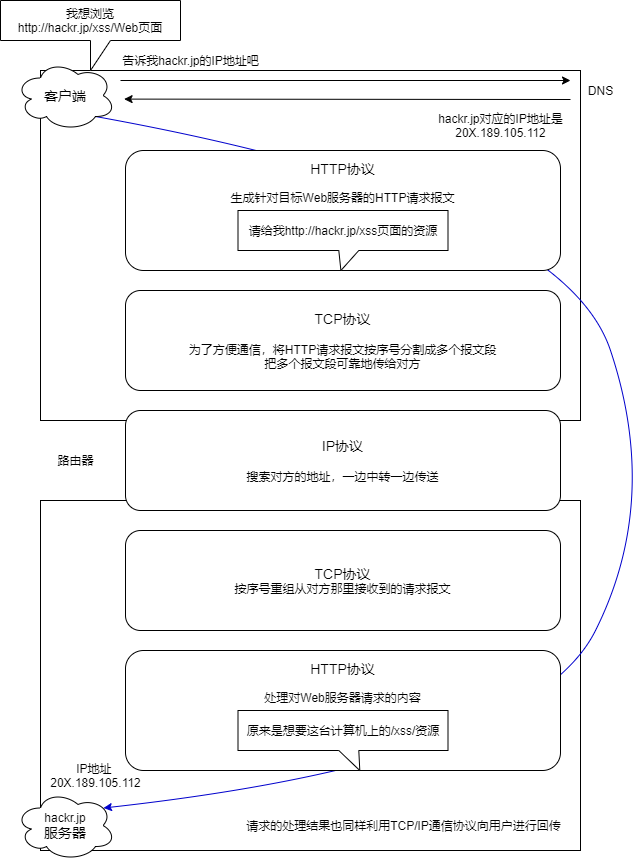

[TOC]


## 一、协议的概念和作用

- 为了让计算机能够通信 计算机需要定义<u>通信规则</u> 这些规则 就是协议
- 规则是多种 协议也有多种
- **协议**就是数据封装格式+传输

服务+协议实现数据传输

- 摩尔斯电码


## 二、OSI七层模型

Open System Interconnection 适用于所有的网络

分工带来效能

将复杂的流程分解为几个功能相对单一的子进程

整个流程更加清晰，复杂问题简单化

更容易发现问题并针对性的解决问题


- 应用层（Application）：网络服务于最终用户的接口
- 表示层（Presentation）：数据的表示、安全、压缩
- 会话层（Session）：建立、管理、中止会话
- 传输层（Transmission）：定义传输数据的协议端口号，以及流控和差错校验（PC）
- 网络层（Network）：进行逻辑地址寻址，实现不同网络之间的路径选择（路由器）
- 数据链路层（Datalink）：建立逻辑连接，进行硬件地址寻址、差错校验等功能（交换机 类似流）
- 物理层（Physics）：提供机械、电气、功能和过程特性（网卡、网线、双绞线、同轴电缆、中继器）


## 三、TCP / IP参考模型

TCP / IP是传输控制协议 / 网络互联协议的简称

早期的TCP / IP模型是一个四层结构，从下往上依次是网络接口层、互联网层、传输层和应用层，后来在使用过程中，借鉴OSI七层参考模型，将网络接口层划分为物理层和数据链路层，形成**五层结构**

由网络层的IP协议和传输层的TCP协议组成，是一个很大的协议集合

物理层和数据链路层没有定义任何特定协议，支持所有的标准和专用的协议

**网络层**定义了网络互联也就是IP协议

- 网际协议IP（Internet Protocol）负责主机和网络之间寻址和路由数据包
- 地址解析协议ARP（Address Resolution Protocol）获得同一物理网络中的硬件主机MAC地址
- 反向地址转换协议（Reverse ~）允许局域网的物理机器从网关服务器的ARP表或者缓存上请求IP地址
- 网际控制消息协议ICMP（Internet Control Message Protocol）发送消息，并报告有关数据包的传送错误
- 互联组管理协议IGMP（Internet Group Management Protocol）IP主机向本地多路广播路由器报告主机组成员

**传输层**定义了TCP（传输控制协议）和UDP（用户数据包）协议

**应用层**定义了HTTP（超文本传输协议）、FTP（文件传输协议）、DNS（域名系统）等协议


### 1. 网络接口层

网络接口层是TCP/IP模型的最底层，负责接收从上一层交来的数据包并将数据包通过底层的物理网络发送出去，比较常见的就是*设备的驱动程序*，此层没有特定的协议，又分为物理层和数据链路层

#### 1.1 物理层

计算机在传递数据的时候传递的都是0和1的数字，物理层关心的是用什么信号来表示0和1，是否可以双向通信（双工、单工、半双工），最初的连接如何建立以及完成连接如何终止，物理层为数据传输提供可靠的环境

为数据端设备提供传送数据的通路，传输数据：

- 激活物理连接，在连接的设备之间连接起来形成通路
- 传输数据，关心如何打包数据和控制传输速度
- 关闭物理连接

#### 1.2 数据链路层

数据链路层位于物理层和互联网层之间，用来向网络层提供数据，就是把源计算机网络层传过来的信息传递给目标主机

- 如何将数据组合成**数据帧（Frame）**，帧是数据链路层的传输单位
- 数据链路的建立、维护和拆除
- 帧包装、帧传输、帧同步
- 帧的差错恢复
- 流量控制

#### 1.3 MAC地址

在通信过程中是用内置在网卡内的地址来标识计算机身份的

MAC地址48位的二进制组成，通常分为6段（6个字节），用16进制表示 

前三个字节（24比特）为供应商标识，后三个字节为供应商对网卡的唯一编号

CISCO: 00-0d-28  IBM: 00-06-1b

每个网卡都有一个全球唯一的地址标识自己，不会重复


### 2. 网络层

位于传输层和网络接口层之间，用于把数据从源主机经过若干个中间节点传送到目标主机，并向传输层提供最基础的数据传输服务，它要提供路由和选址的工作

#### 2.1 选址

交换机是靠MAC来寻址的，而因为MAC地址无层次的，所以要靠IP地址来确认计算机的位置，这就是选址

先从IP地址找到局域网，再从MAC找到地址；MAC地址类似于个体，IP地址相当于具体地址，数据链路层是把IP解析成MAC

#### 2.2 路由

在能够选择的多条道路之间选择一条最短的路径就是路由的工作

#### 2.3 IP

##### 2.3.1 头部

IP地址的网络部分是由Internet地址分配机构来统一分配的，以保证IP的唯一性

全为1的IP即255.255.255.255，称为限制广播地址，若将其作为数据包的目标地址，可以理解为发送到所有网络的所有主机

全为0的IP即0.0.0.0，表示启动时的IP地址，含义为尚未分配时的IP地址

127是用来进行本机测试的，除了127.255.255.255外，其它的127开头的地址都代表本机

##### 2.3.2 分类

| **分类** |        1~8        |  9~16   |  17~24  | 25~32 | 每个网络中最大主机数量 |
| :------: | :---------------: | :-----: | :-----: | :---: | :--------------------: |
|   A类    |  0NNNNNNN(1~126)  |  Host   |  Host   | Host  |         2^24-2         |
|   B类    | 10NNNNNN(128~191) | Network |  Host   | Host  |         2^16-2         |
|   C类    | 110NNNNN(192~223) | Network | Network | Host  |         2^8-2          |

**公有地址和私有地址**

私有IP：

A类私有IP：10.0.0.0 ~ 10.255.255.255

B类私有IP：172.16.0.0 ~ 172.31.255.255

C类私有IP：192.168.0.0 ~ 192.168.255.255

其他范围的IP均为公有IP地址

##### 2.3.3 子网掩码

子网掩码（subnet mask）又称子网络遮罩，用来指明一个IP地址的哪些位标识的是主机所在的子网，以及哪些位标识的是主机位。子网掩码不能单独存在，而必须结合IP地址一起使用

子网掩码只有一个作用，就是将某个IP地址划分成网络地址和主机地址两部分

- 子网掩码也是32个二进制位
- 网络部分用1表示，主机部分用0表示——掩饰的是主机部分
- IP地址和子网掩码做逻辑与运算得到网络地址

A（255.0.0.0）、B（255.255.0.0）、C（255.255.255.0）三类地址有默认的子网掩码

如果不同的IP的网络部分相同，那么他们就在一个网络内


不同层中的称谓：

- 数据帧（Frame）：一种信息单位，它的起始点和目的点都是数据链路层
- 数据包（Packet）：一种信息单位，起始和目的地是网络层
- 段（Segment）：通常指起始点和目的地都是传输层的信息单元
- 消息（message）：指起始点和目的地都在网络层以上（常在应用层）的信息单元

TOS（IP头部中的服务类型）

8位，包括

| 3bit的优先权字段（000~111） | 4bit的TOS子字段 | 1bit未用位必须置0 |
| :-------------------------: | :-------------: | :---------------: |
|                             |                 |                   |


### 3. 传输层

位于应用层和网络接口层之间

- 是**面向连接**的（保证双向的接收和发送都是正常的）、

  **可靠的** *进程到进程* 通信的（HTTP服务器启动一个进程监听） 协议

- TCP提供*全双工服务*，即数据可在同一时间双向传播

- TCP**基于字节流**，将若干个字节构成一个分组，此分组称为报文*段（Segment）*

**功能**：提供一种端到端的连接

**特点**：对可靠性要求高的上层协议，实现可靠性的保证（数据丢失、损坏的情况下如何保证可靠性，网络层只管传递数据，不关心成功与否）

**TCP功能**

- 将数据进行分段打包传输
- 对每个数据包编号控制顺序
- 运输中丢失、重发和丢弃处理
- 流量控制避免拥塞

#### 3.1 TCP数据包封装


**源端口、目标端口**

如何标识唯一标识一个连接？ TCP 连接的四元组——源 IP、源端口、目标 IP 和目标端口

因为在 IP 层就已经处理了 IP ，TCP 只需要记录两者的端口即可

 **32位序列号**

即`Sequence number`, 指的是本报文段第一个字节的序列号，序列号是一个长为 4 个字节，也就是 32 位的无符号整数，表示范围为 0 ~ 2^32 - 1。如果到达最大值了后就循环到0

TCP用序列号对数据包进行标记，以便在到达目的地后重新组装，假设当前序列号为s，发送数据长度为l，则下次发送数据时的序列号为s+l

- 在 SYN 报文中交换彼此的初始序列号ISN
- 保证数据包按正确的顺序组装

> **ISN**即`Initial Sequence Number（初始序列号）`，在三次握手的过程当中，双方会用过`SYN`报文来交换彼此的 `ISN`
>
> ISN 并不是一个固定的值，而是每 4 `ms` 加一，溢出则回到 0，这个算法使得猜测 ISN 变得很困难
>
> 如果 ISN 被攻击者预测到，源 IP 和源端口号都是很容易伪造的，当攻击者猜测 ISN 之后，直接伪造一个 RST 后，就可以强制连接关闭，这是非常危险的
>
> 而动态增长的 ISN 大大提高了猜测 ISN 的难度

**确认号**：即`ACK(Acknowledgment number)`，用来告知对方下一个期望接收的序列号，<u>小于ACK</u>的所有字节已经全部收到

**控制位**：对TCP的连接、传输和断开进行指挥

- URG（urgent紧急位）：紧急信号
- ACK（acknowledgement确认位）：确认序列号有效位，表明该数据包包含确认信息

- PSH（push急迫位）：缓存区将满，立刻传入数据
- RST（reset重置位）：连接断了重新连接
- SYN（synchronous建立联机 同步序列号位）：TCP建立连接时设为1
- FIN（finish发送端完成位）：提出断开连接的一方把FIN置1表示要断开连接

**紧急指针**：仅在URG（urgent紧急位）控制位为1时有效，表示紧急数据的末尾在TCP数据部分中的位置，通常在暂时中断通信时使用（比如输入ctrl+C）

**窗口值**：说明本地可接收数据段的数目，这个值的大小是可变的，用来在TCP传输中进行流量控制，TCP 引入了<u>窗口缩放</u>的选项，作为窗口缩放的比例因子，这个比例因子的范围在 0 ~ 14，比例因子可以将窗口的值扩大为原来的 2 ^ n 次方

当网络通畅时将这个窗口值变大加快传输速度，当网络不稳定时减少这个值可以保证网络数据的可靠传输

**校验和**：用来做差错控制，TCP校验和的计算包括TCP首部、数据和其它填充字节。在发送TCP数据段时，由发送端计算校验和，当到达目的地时又进行一次检验和计算。如果两次校验和一致说明数据是正确的，否则将认为数据被破坏，接收端将丢弃该数据

**可选项**

` 种类（Kind）1byte | 长度（Length）1byte | 值（value） `

- `TimeStamp`: TCP 时间戳
- MSS: 指的是 TCP 允许的从对方接收的最大报文段
- SACK: 选择确认选项
- Window Scale：窗口缩放选项
- 

#### 3.2 传输

##### 3.2.1 三次握手和四次断开

- TCP是面向连接的协议，它在源点和终点之间建立虚拟连接，而不是物理连接
- 在数据通信之前，发送端与接收端要先建立连接，等数据发送结束后，双方再断开连接
- TCP连接的每一方都是由一个IP地址和一个端口组成


1. **三次握手**：通过三次握手(即总共发送3个数据包确认已经建立连接)建立客户端和服务器之间的连接

   是需要确认双方的两样能力: <u>发送的能力和接收的能力</u>

   SYN, `seq` = x

   SYN、ACK, `seq` = y, ack = x + 1

   ACK, `seq` = x + 1, ack = y + 1

   从最开始双方都处于`CLOSED`状态。然后服务端开始监听某个端口，进入了`LISTEN`状态

   - 第一次：主机A通过一个标识为SYN标识位的数据段发送给主机B请求连接，通过该数据段告诉主机B希望建立连接，需要B应答，并告诉主机B传输的起始序列号

     （客户端主动发起连接，发送 SYN , 自己变成了`SYN-SENT`状态）

   - 第二次：主机B用一个确认应答ACK和同步序列号SYN标示位的数据段来响应主机A，一是发送ACK告诉主机A收到了数据段，二是通知主机A从哪个序列号做标记

     （服务端接收到，返回`SYN`和`ACK`(对应客户端发来的SYN)，自己变成了`SYN-REVD`）

   - 第三次：主机A确认收到了主机B的数据段并可以开始传输实际数据

     （客户端再发送`ACK`给服务端，自己变成了`ESTABLISHED`状态；服务端收到`ACK`之后，也变成了`ESTABLISHED`状态）

   > **`seq`(sequence number)**：表示的是我方（发送方）这边，这个packet的数据部分的第一位应该在整个data stream中所在的位置（注意这里使用的是“应该”，因为对于没有数据的传输，如ACK，虽然它有一个`seq`，但是这次传输在整个data stream中是不占位置的，所以下一个实际有数据的传输，会依旧从上一次发送ACK的数据包的`seq`开始）
   >
   > **`ack`(acknowledge number)**：表示的是期望的对方（接收方）的下一次sequence number是多少
   >
   > 注意，SYN/FIN的传输虽然没有data，但是会让下一次传输的packet `seq`增加1（即需要消耗一个序列号），但是ACK的传输，不会让下一次的传输packet加1：<u>凡是需要对端确认的，一定消耗TCP报文的序列号</u>；SYN 需要对端的确认， 而 ACK 并不需要，因此 SYN 消耗一个序列号而 ACK 不需要

   **为什么不是两次？**

   根本原因: 无法确认客户端的接收能力

   如果是两次，现在发了 SYN 报文想握手，但是这个包滞留在了当前的网络中迟迟没有到达，TCP 以为这是丢了包，于是重传，两次握手建立好了连接

   看似没有问题，但是连接关闭后，如果这个滞留在网路中的包到达了服务端呢？这时候由于是两次握手，服务端只要接收到然后发送相应的数据包，就默认建立连接，但是现在客户端已经断开了，这就带来了连接资源的浪费

   **为什么不是四次？**

   三次就足够了，再多用处就不大了

   **三次握手过程中可以携带数据么？**

   第三次握手的时候，可以携带，前两次握手不能携带数据

   如果前两次握手能够携带数据，那么一旦有人想攻击服务器，那么他只需要在第一次握手中的 SYN 报文中放大量数据，那么服务器势必会消耗更多的时间和内存空间去处理这些数据，增大了服务器被攻击的风险

   第三次握手的时候，客户端已经处于`ESTABLISHED`状态，并且已经能够确认服务器的接收、发送能力正常，这个时候相对安全了，可以携带数据

2. 进行数据传输：这里有一个重要的机制，就是接收方接收到数据包后必须要向发送方确认, 如果发送方没有接到这个确认的消息，就判定为数据包丢失，并重新发送该数据包，当然，发送的过程中还有一个优化策略，就是把大的数据包拆成一个个小包，依次传输到接收方，接收方按照这个小包的顺序把它们组装成完整数据包


1. **四次挥手**

   ACK、FIN, `seq` = p

   ACK, ack = p + 1

   ACK、FIN, `seq` = q, ack = p + 1

   ACK, ack = q + 1

   刚开始双方处于`ESTABLISHED`状态

   - 主机A发送FIN控制位发出断开连接的请求

     （客户端要断开了，向服务器发送 `FIN` 报文，发送后客户端变成了`FIN-WAIT-1`状态。注意, 这时候客户端同时也变成了`half-close`(半关闭)状态，即无法向服务端发送报文，只能接收）

   - 主机B进行响应，确认收到断开连接请求

     （服务端接收后向客户端确认，变成了`CLOSED-WAIT`状态；客户端接收到了服务端的确认，变成了`FIN-WAIT2`状态）

   - 主机B提出反方向的关闭要求

     （服务端向客户端发送`FIN`，自己进入`LAST-ACK`状态）

   - 主机A确认收到的主机B的关闭连接请求

     （客户端收到服务端发来的`FIN`后，自己变成了`TIME-WAIT`状态，然后发送 ACK 给服务端

     这个时候，客户端需要等待足够长的时间，具体来说，是 2 个 `MSL`(`Maximum Segment Lifetime`，报文最大生存时间)，在这段时间内如果客户端没有收到服务端的重发请求，那么表示 ACK 成功到达，挥手结束，否则客户端重发 ACK）

   **等待2MSL的意义**

   如果不等待，客户端直接跑路，当服务端还有很多数据包要给客户端发，且还在路上的时候，若客户端的端口此时刚好被新的应用占用，那么就接收到了无用数据包，造成数据包混乱，所以最保险的做法是等服务器发来的数据包都死翘翘再启动新的应用

   - 1 个 MSL 确保四次挥手中主动关闭方最后的 ACK 报文最终能达到对端
   - 1 个 MSL 确保对端没有收到 ACK 重传的 FIN 报文可以到达

   **为什么是四次挥手而不是三次？**

   因为服务端在接收到`FIN`, 往往不会立即返回`FIN`, 必须等到服务端所有的报文都发送完毕了，才能发`FIN`，因此先发一个`ACK`表示已经收到客户端的`FIN`，延迟一段时间才发`FIN`，这就造成了四次挥手

   如果是三次挥手等于说服务端将`ACK`和`FIN`的发送合并为一次挥手，这个时候长时间的延迟可能会导致客户端误以为`FIN`没有到达客户端，从而让客户端不断的重发`FIN`

##### 3.2.2 SYN Flood攻击

三次握手前，服务端的状态从`CLOSED`变为`LISTEN`, 同时在内部创建了两个队列：半连接队列和全连接队列，即SYN队列和ACCEPT队列

**半连接队列**

当客户端发送`SYN`到服务端，服务端收到以后回复`ACK`和`SYN`，状态由`LISTEN`变为`SYN_RCVD`，此时这个连接就被推入了SYN队列，也就是半连接队列

**全连接队列**

当客户端返回`ACK`, 服务端接收后，三次握手完成。这个时候连接等待被具体的应用取走，在被取走之前，它会被推入另外一个 TCP 维护的队列，也就是全连接队列(Accept Queue)

**SYN Flood 攻击原理**

SYN Flood 属于典型的 `DoS/DDoS` 攻击，其攻击的原理就是用客户端在短时间内伪造大量不存在的 IP 地址，并向服务端疯狂发送`SYN`，对于服务端而言，会产生两个危险的后果:

1. 处理大量的`SYN`包并返回对应`ACK`, 势必有大量连接处于`SYN_RCVD`状态，从而占满整个<u>半连接队列</u>，无法处理正常的请求
2. 由于是不存在的 IP，服务端长时间收不到客户端的`ACK`，会导致服务端不断重发数据，直到耗尽服务端的资源

**如何应对 SYN Flood 攻击？**

1. 增加 SYN 连接，也就是增加半连接队列的容量
2. 减少 SYN + ACK 重试次数，避免大量的超时重发
3. 利用 SYN Cookie 技术，在服务端接收到`SYN`后不立即分配连接资源，而是根据这个`SYN`计算出一个Cookie，连同第二次握手回复给客户端，在客户端回复`ACK`的时候带上这个`Cookie`值，服务端验证 Cookie 合法之后才分配连接资源

##### 3.2.3 TFO

优化后的 TCP 握手流程，也就是TCP 快速打开(TCP Fast Open, 即TFO)优化的过程即使用 解决SYN Flood 攻击的 **SYN Cookie**，这个 Cookie 不是浏览器的`Cookie`, 用它同样可以实现 TFO

**首轮三次握手**

首先客户端发送`SYN`给服务端，服务端接收到

服务端不是立刻回复 SYN + ACK，而是通过计算得到一个`SYN Cookie`, 将这个`Cookie`放到 TCP 报文的 `Fast Open`选项中，然后才给客户端返回

客户端拿到这个 Cookie 的值缓存下来，后面正常完成三次握手

**后面的三次握手**

之后的握手中，客户端会将之前缓存的 `Cookie`、`SYN` 和HTTP请求发送给服务端，服务端验证了 Cookie 的合法性，如果不合法直接丢弃；如果是合法的，那么就正常返回`SYN + ACK`

现在服务端能向客户端发 HTTP 响应了——<u>三次握手还没建立，仅仅验证了 Cookie 的合法性，就可以返回 HTTP 响应了</u>

当然，客户端的`ACK`还得正常传过来，才能叫三次握手嘛

> 客户端最后握手的 ACK 不一定要等到服务端的 HTTP 响应到达才发送，两个过程没有任何关系

**TFO 的优势**

TFO 的优势并不在与首轮三次握手，而在于后面的握手，在拿到客户端的 Cookie 并验证通过以后，可以直接返回 HTTP 响应，充分利用了**1 个RTT**(Round-Trip Time，往返时延)的时间**提前进行数据传输**，积累起来还是一个比较大的优势

##### 3.2.4 时间戳`timestamp`

`timestamp`是 TCP 报文首部的一个可选项，一共占 10 个字节

```
kind(1 字节) + length(1 字节) + info(8 个字节)
```

其中 kind = 8， length = 10， info 有两部分构成: `timestamp`和`timestamp echo`，各占 4 个字节。

TCP 的时间戳主要解决两大问题:

- **计算往返时延 RTT(Round-Trip Time)**

  实际上无论开始时间以第一次发包还是第二次发包为准，计算 RTT 都是不准确的,引入时间戳就很好的解决了这个问题

  - step 1: a 向 b 发送的时候，`timestamp` 中存放的内容就是 a 主机发送时的内核时刻 `ta1`
  - step 2: b 向 a 回复 s2 报文的时候，`timestamp` 中存放的是 b 主机的时刻 `tb`, `timestamp echo`字段为从 s1 报文中解析出来的` ta1`
  - step 3: a 收到 b 的 s2 报文之后，此时 a 主机的内核时刻是 ta2, 而在 s2 报文中的 `timestamp echo` 选项中可以得到 `ta1`, 也就是 s2 对应的报文最初的发送时刻。然后直接采用 `ta2 - ta1` 就得到了 RTT 的值

- **防止序列号的回绕问题**

  假设序列号的范围是 0 ~ 4，那么到达 4 的时候会回到 0，假设在第 6 次的时候，之前还滞留在网路中的包回来了，那么就有两个序列号为`1 ~ 2`的数据包了，这个时候就产生了序列号回绕的问题

  用 `timestamp` 就能很好地解决这个问题，因为每次发包的时候都是将发包机器当时的内核时间记录在报文中，那么两次发包序列号即使相同，时间戳也不可能相同，这样就能够区分开两个数据包了

##### 3.2.5 超时重传时间

TCP 具有超时重传机制，即间隔一段时间没有等到数据包的回复时，重传这个数据包

这个重传间隔也叫做超时重传时间(`Retransmission TimeOut`, 简称RTO)，它的计算跟上一节提到的 RTT 密切相关

**经典方法**

经典方法引入了一个新的概念——SRTT(Smoothed round trip time，即平滑往返时间)，没产生一次新的 RTT. 就根据一定的算法对 SRTT 进行更新，具体而言，计算方式如下(SRTT 初始值为0):

```
SRTT =  (α * SRTT) + ((1 - α) * RTT)
```

其中，α 是**平滑因子**，建议值是`0.8`，范围是`0.8 ~ 0.9`。

拿到 SRTT，我们就可以计算 RTO 的值了:

```
RTO = min(ubound, max(lbound, β * SRTT))
```

β 是加权因子，一般为`1.3 ~ 2.0`， **lbound** 是下界，**ubound** 是上界。

其实这个算法过程还是很简单的，但是也存在一定的局限，就是在 RTT 稳定的地方表现还可以，而在 RTT 变化较大的地方就不行了，因为平滑因子 α 的范围是`0.8 ~ 0.9`, RTT 对于 RTO 的影响太小。

**标准方法**

为了解决经典方法对于 RTT 变化不敏感的问题，后面又引出了标准方法，也叫`Jacobson / Karels 算法`

第一步: 计算`SRTT`，公式如下:

```
SRTT = (1 - α) * SRTT + α * RTT
```

注意这个时候的 `α`跟经典方法中的`α`取值不一样了，建议值是`1/8`，也就是`0.125`

第二步: 计算`RTTVAR`(round-trip time variation)这个中间变量

```
RTTVAR = (1 - β) * RTTVAR + β * (|RTT - SRTT|)
```

β 建议值为 0.25。这个值是这个算法中出彩的地方，也就是说，它记录了最新的 RTT 与当前 SRTT 之间的差值，给我们在后续感知到 RTT 的变化提供了抓手。

第三步: 计算最终的`RTO`:

```
RTO = µ * SRTT + ∂ * RTTVAR
```

`µ`建议值取`1`, `∂`建议值取`4`。

这个公式在 SRTT 的基础上加上了最新 RTT 与它的偏移，从而很好的感知了 RTT 的变化，这种算法下，RTO 与 RTT 变化的差值关系更加密切。

##### 3.2.6 流量控制

对于发送端和接收端而言，TCP 需要把发送的数据放到发送缓存区, 将接收的数据放到接收缓存区。

而流量控制索要做的事情，就是在通过接收缓存区的大小，控制发送端的发送。如果对方的接收缓存区满了，就不能再继续发送了。

TCP **滑动窗口**分为两种: **发送窗口**和**接收窗口**

滑动窗口包含四大部分:

- 已发送且已确认
- 已发送但未确认
- 未发送但可以发送
- 未发送也不可以发送

##### 3.2.7 拥塞控制

对于拥塞控制来说，TCP 每条连接都需要维护两个核心状态：

- 拥塞窗口（Congestion Window，`cwnd`）
- 慢启动阈值（Slow Start Threshold，`ssthresh`）

涉及到的算法有这几个：

- 慢启动
- 拥塞避免
- 快速重传和快速恢复

#### 3.3 抓包

#### 3.4 UDP

##### 与TCP的区别	

**TCP（Transmission Control Protocol）**：传输控制协议；可靠的、面向连接的协议；传输效率低

**UDP（User Datagram Protocol）**：用户数据包协议；不可靠的、无连接的协议；传输效率高

具体来分析，和 `UDP` 相比，`TCP` 有三大核心特性:

1. **面向连接**：所谓的连接，指的是客户端和服务器的连接，在双方互相通信之前，TCP 需要三次握手建立连接，而 UDP 没有相应建立连接的过程。

2. **可靠性**：TCP 花了非常多的功夫保证连接的可靠，这个可靠性体现在哪些方面呢？一个是有状态，另一个是可控制。

   TCP 会精准记录哪些数据发送了，哪些数据被对方接收了，哪些没有被接收到，而且保证数据包按序到达，不允许半点差错，这是**有状态**

   当意识到丢包了或者网络环境不佳，TCP 会根据具体情况调整自己的行为，控制自己的发送速度或者重发，这是**可控制**

   相应的，UDP 就是<u>无状态，不可控</u>的。

3. **面向字节流**：UDP 的数据传输是基于数据包的，这是因为仅仅只是继承了 IP 层的特性，而 TCP 为了维护状态，将一个个 IP 包变成了字节流

UDP是一个无连接、不保证可靠性的传输层协议，即发送端不关心发送的数据是否到达目标主机、数据是否出错等，收到数据的主机也不会告诉发送方是否收到了数据，它的可靠性<u>由上层协议来保障</u>

首部结构简单，在数据传输时能实现最小的开销，如果进程想发送很短的报文而对可靠性要求不高可以使用

**应用**：QQ、视频软件、TFTP简单文件传输协议（短信）

##### 组播

所谓组播，就是将网络中同一业务类型进行逻辑上的分组，从某个socket端口上发送的数据只能被该组中的其他主机所接收，不被组外的任何主机接收

实现组播时，并不直接把数据发送给目标地址，而是将数据发送到组播主机，操作系统将把该数据组播给组内的其他所有成员

在网络中，使用D类地址作为组播地址，范围指224.0.0.0 ~ 239.255.255.255，分为三类：

- 局部组播地址：224.0.0.0 ~ 224.0.0.255 为路由协议和其他用途保留
- 预留组播地址：224.0.1.0 ~ 238.255.255.255 可用于全球范围或网络协议
- 管理权限组播地址：239.0.0.0 ~ 239.255.255.255 组织内部使用，不可用于Internet


#### 3.5 DNS服务器

##### 3.5.1 域名

| 名称类型 |                      说明                      |     实例      |
| :------: | :--------------------------------------------: | :-----------: |
|   根域   |      一般认为全球共有13台根逻辑域名服务器      | 单个句点（.） |
|  顶级域  | 用来指示某个国家/地区/组织使用的名称的类型名称 |     .com      |
| 第二层域 |         个人/组织在网上使用的注册名称          |    zol.com    |
|   子域   |           已注册的二级域名派生的域名           |  www.zol.com  |

| DNS域名  |   cn / ru   |   com    |   net    |   edu    |     Mil      |      gov       |
| :------: | :---------: | :------: | :------: | :------: | :----------: | :------------: |
| 组织类型 | 中国/俄罗斯 | 商业公司 | 网络公司 | 教育机构 | 军事政府机构 | 非军事政府机构 |

##### 3.5.2 DNS服务器

DNS（Domain Name Service）服务器进行域名和与之对应的IP地址转换的服务器

IP地址不易记忆；早期使用Hosts文件解析域名，主要名称重复、主机维护困难

DNS（Domain Name System）域名系统：分布式、层次性

##### 3.5.3 访问过程

| 客户端向本地域名服务器发出请求       | 访问www.163.com，求IP地址            |
| ------------------------------------ | ------------------------------------ |
| 本地DNS服务器向**DNS根服务器**发请求 | 根服务器回复本地服务器（.com）的地址 |
| 本地DNS服务器向**（.com域）**发请求  | 得到（163.com）的服务器地址          |
| 本地DNS服务器向**（163.com）**发请求 | 得到（www.163.com）的IP地址1.1.1.1   |
| 本地DNS服务器向**客户端**回复        | 域名（www.163.com）的IP地址是1.1.1.1 |


### 4. 应用层

#### 4.1 URI和URL

**URI**（Uniform Resource Identifier）是统一资源标识符，在某个规则下能把这个资源独一无二标示出来，比如人的身份证号，用来区分互联网上不同的资源

- Uniform 不用根据上下文来识别资源指定的访问方式
- Resource 可以标识的任何东西
- Identifier 表示可标识的对象

**URL**（Uniform Resource Location）是统一资源定位符，表示资源的地点，URL是使用浏览器访问WEB页面时需要输入的网页地址

- Uniform 不用根据上下文来识别资源指定的访问方式
- Resource 可以标识的任何东西
- Location 定位

> 格式：```scheme://usr:pwd@ host:port path ?query #fragment```

协议类型（登录信息） 服务器地址 服务器端口号 带层次的文件路径 查询字符串```key=val&key=val``` 片段标识符（锚点）

> 编码

URL 只能使用ASCII, ASCII 之外的字符是不支持显示的，而且还有一部分符号是界定符，如果不加以处理就会导致解析出错。
因此，URL引入了编码机制，将所有非 ASCII 码字符和界定符转为十六进制字节值，然后在前面加个%。
如，空格被转义成了%20，三元被转义成了%E4%B8%89%E5%85%83。


#### 4.2 HTTP超文本传输协议



**长连接**

TCP连接复用，同一个TCP连接来传输多个HTTP请求，避免TCP连接建立时的三次握手开销，和初建TCP连接时传输窗口小的问题

**管线化**

##### 4.2.1 请求报文和响应报文

**请求报文**

```
POST /form/entry HTTP/1.1 // 请求行     
Host: hackr.jp // 请求首部字段
Connection: keep-alive // 通用首部
Content-Type: application/x-www-form-urlencoded // 实体首部
Content-Lenghth: 16 // 实体首部

name=ueno&age=37 // 内容实体
```


- 请求行
  - 方法
    - GET 获取资源
    - POST 向服务器端发送数据，传输实体主体
    - PUT 传输文件 修改数据
    - DELETE 删除文件
    - HEAD 获取报文首部
    - CONNECT  多用于HTTPS和`Websocket` 建立连接隧道 用于代理服务器
    - OPTIONS 询问支持的方法（跨域）
    - TRACE 追踪传输路径
  - URL
  - 协议版本号

> GET 和 POST 有什么区别？

- 首先最直观的是语义上的区别。
- 从*缓存*的角度，GET 请求会被浏览器主动缓存下来，留下历史记录，而 POST 默认不会。
- 从*编码*的角度，GET 只能进行 URL 编码，只能接收 ASCII 字符，而 POST 没有限制。
- 从*参数*的角度，GET 一般放在 URL 中，因此不安全，POST 放在请求体中，更适合传输敏感信息。
- 从*幂等性*的角度，GET是幂等的，而POST不是。(幂等表示执行相同的操作，结果也是相同的)
- 从*TCP*的角度，GET 请求会把请求报文一次性发出去，而 POST 会分为两个 TCP 数据包，首先发 header 部分，如果服务器响应 100(continue)， 然后发 body 部分。(火狐浏览器除外，它的 POST 请求只发一个 TCP 包)

**响应报文**

```
HTTP/1.1 200 OK // 响应行
Date: Sun, 20 Sep 2020 09:28:18 GMT // 通用首部字段
Content-Length: 362 // 实体首部
Content-Type: text/html // 实体首部

<html> // 主体
...
```

- 响应行
  - 协议版本
  - 状态码
  - 状态码的原因短语
- 响应头
- 响应体

##### 4.2.2 编码（数据传输）

HTTP可以在传输过程中通过编码提升传输效率，但是会消耗更多的CPU时间

**4.2.2.1 编码压缩**

发送文件时可以先用ZIP压缩功能后再发送文件

> 编码规范：`gzip` compress deflate identify

###### 4.2.2.2 分块传输

**定长包体**

对于定长包体而言，发送端在传输的时候一般会带上```Content-Length```, 来指明包体的长度

```Content-Length```对于 http 传输过程起到了十分关键的作用，如果设置不当可以直接导致传输失败

**不定长包体**
http 头部字段:

```
Transfer-Encoding: chunked
```

表示分块传输数据，设置这个字段后会自动产生两个效果:

- Content-Length 字段会被忽略
- 基于长连接持续推送动态内容

```Connection: keep-alive```之前的为响应行和响应头，后面的为响应体

响应体的结构

```
chunk长度（16进制）
内容
chunk长度（16进制）
内容
...
0

```

最后留有一个空行

**大容量数据**

传输大容量数据时，通过把数据分割成多块（chunk），能让浏览器逐步显示页面

见*范围请求*

**4.2.2.3 多部分对象集合**

一份报文主体中可以包含多类型实体

使用```boundary```字符串来划分多部分对象指明的各类实体，在各个实体起始行之前插入```--```标记，多部分对象集合最后插入```--```标记

> ```multipart/form-data```
>
> ```multipart/byteranges 206(Partical Content)``` 断连续传

###### 4.2.2.4 范围请求

为了实现中断恢复下载的需求以及处理大文件的传输，需要能下载指定下载的实体范围，获取部分内容

**服务器要支持范围请求**就必须加上一个响应头```Accept-Ranges: none```用来告知客户端这边是支持范围请求的

**Range|Content-Range**

而对于客户端而言，它需要指定请求哪一部分，通过```Range```这个请求头字段确定，格式为```bytes=x-y```

> -0-499表示从开始到第 499 个字节。
> 500- 表示从第 500 字节到文件终点。
> -100表示文件的最后100个字节。

```
// 单段数据
Range: bytes=0-9
// 多段数据
Range: bytes=0-9, 30-39
```

服务器收到请求之后，首先验证范围是否合法，如果越界了那么返回```416```错误码，否则读取相应片段，返回```206```状态码
同时，服务器需要添加```Content-Range```字段，这个字段的格式根据请求头中```Range```字段的不同而有所差异
具体来说，请求*单段数据*和请求*多段数据*，响应头是不一样的

```
// 对于单段数据的请求
HTTP/1.1 206 Partial Content
Content-Length: 10
Accept-Ranges: bytes
Content-Range: bytes 0-9/100 

i am xxxxx
```

```Content-Range```字段，0-9表示请求的返回，100表示资源的总大小

```
// 对于多段数据的请求
HTTP/1.1 206 Partial Content
Content-Type: multipart/byteranges; boundary=00000010101
Content-Length: 189
Connection: keep-alive
Accept-Ranges: bytes


--00000010101
Content-Type: text/plain
Content-Range: bytes 0-9/96

i am xxxxx
--00000010101
Content-Type: text/plain
Content-Range: bytes 20-29/96

eex jspy e
--00000010101--
```

对于多重范围的范围请求，响应会在首部字段标明```Content-Type: multipart/byteranges;boundary=```：

- 请求一定是多段数据请求

- 响应体中的分隔符是 

  在响应体中各段数据之间会由这里指定的分隔符分开，而且在最后的分隔末尾添上--表示结束

###### 4.2.2.5 处理表单数据的提交

在 http 中，有两种主要的表单提交的方式，体现在两种不同的```Content-Type```取值:

- ```application/x-www-form-urlencoded```
- ```multipart/form-data```

对于```application/x-www-form-urlencoded```格式的表单内容，数据会被编码成以```&```分隔的键值对，字符以URL编码方式编码

对于**```multipart/form-data```**而言，请求头中的```Content-Type```字段会包含```boundary```，且boundary的值有浏览器默认指定，数据会分为多个部分，每两个部分之间通过分隔符来分隔，每部分表述均有 HTTP 头部描述子包体，如Content-Type，在最后的分隔符会加上```--```表示结束

```multipart/form-data```格式最大的特点在于*每一个表单元素都是独立的资源表述*
另外，你可能在写业务的过程中，并没有注意到其中还有boundary的存在，如果你打开抓包工具，确实可以看到不同的表单元素被拆分开了，之所以在平时感觉不到，是以为浏览器和 HTTP 给你封装了这一系列操作。

在实际的场景中，对于图片等文件的上传，基本采用```multipart/form-data```而不用```application/x-www-form-urlencoded```，因为没有必要做 URL 编码，带来巨大耗时的同时也占用了更多的空间

##### 4.2.3 内容协商（Accept系列字段）

数据格式、字符集、压缩方式、支持语言

> 首部字段（接收端|发送端）

- Accept|Content-Type
- Accept-Charset|Content-Type
- Accept-Encoding|Content-Encoding
- Accept-Language|Content-Language

1. 数据格式
   HTTP 从```MIME type```取了一部分来标记报文 body 部分的数据类型，体现在```Content-Type|Accept```字段
   这两个字段的取值可以分为下面几类:

   - text：```text/html, text/plain, text/css``` 等
   - image: ```image/gif, image/jpeg, image/png ```等
   - audio/video: ```audio/mpeg, video/mp4 ```等
   - application: ```application/json, application/javascript, application/pdf, application/octet-stream```

   > MIME(Multipurpose Internet Mail Extensions, 多用途互联网邮件扩展)。它首先用在电子邮件系统中，让邮件可以发任意类型的数据，这对于 HTTP 来说也是通用的。

2. 字符集

   ```
   // 发送端
   Content-Type: text/html; charset=utf-8
   // 接收端
   Accept-Charset: charset=utf-8
   ```

3. 压缩方式

   见编码压缩

4. 支持语言

   ```zh-CN, zh, en```

协商类型

- 服务器驱动
- 客户端驱动协商
- 透明协商

##### 4.2.4 状态码

状态码负责表示客户端请求的返回结果、标记服务器端是否正常、通知出现的错误

| 类别 | 原因短语                         |
| :--: | :------------------------------- |
| 1XX  | Information（信息性状态码）      |
| 2XX  | Success（成功状态码）            |
| 3XX  | Redirection（重定向）            |
| 4XX  | Client Error（客户端错误状态码） |
| 5XX  | Server Error（服务器错误状态码） |

**1XX** 临时回应 表示客户端请继续

- 101 在HTTP升级为```WebSocket```时，服务器同意变更即发送状态码101

**2XX成功**

- 200（OK）客户端发过来的数据被正常处理
- 204（Not Content）正常响应，没有实体
- 206（Partial Content）范围请求，返回部分数据，响应报文中由Content-Range指定实体内容，使用场景为HTTP分块下载和断电续传

**3XX重定向**

- 301（Moved Permanently）永久重定向，此时浏览器默认做缓存优化，再次访问时自动访问重定向的地址

- 302（Found）临时重定向，规范要求方法名不变，但是都会改变，浏览器不会做缓存优化

- 303（See Other）和302类似，但必须用GET方法

- 304（Not Modified）状态未改变，配合（If-Match、If-Modified-Since、If-None_Match、If-Range、If-Unmodified-Since）——缓存

  协商缓存命中时：客户端本地已有缓存的版本，并在Request中告诉了服务端，当服务端通过时间或者tag发现没有更新时，就会返回不含body的304状态

- 307（Temporary Redirect）临时重定向，不该改变请求方法

**4XX客户端错误**

- 400（Bad Request）请求报文语法错误
- 401（Unauthorized）需要认证
- <u>403</u>（Forbidden）服务器拒绝访问对应的资源（无权限）
- <u>404</u>（Not Found）服务器上无法找到资源
- 405（Method Not Allowed）请求方法不被服务器端允许
- <u>406</u>（Not Acceptable）资源无法满足客户端的条件
- 408 Request Timeout: 服务器等待了太长时间
- 409 Conflict: 多个请求发生了冲突
- 413 Request Entity Too Large: 请求体的数据过大
- 414 Request-URI Too Long: 请求行里的 URL 太大
- <u>416</u> 范围请求的范围越界
- <u>429</u> Too Many Request: 客户端发送的请求过多
- 431 Request Header Fields Too Large 请求头的字段内容太大。

**5XX服务器端错误**

- 500（Internal Server Error）服务器故障
- 501 Not Implemented: 表示客户端请求的功能还不支持
- 502 Bad Gateway: 服务器自身是正常的，但访问的时候出错了，啥错误咱也不知道。
- 503（Service Unavailable）服务器处于超负载或正在停机维护
- 504 代理缓存无效

##### 4.2.5 首部

**通用首部字段**

**请求首部字段**

**响应首部字段**

**实体首部字段**


#### 4.3 HTTP特点及缺点

**HTTP 特点**

- 灵活可扩展，主要体现在两个方面。一个是语义上的自由，只规定了基本格式，比如空格分隔单词，换行分隔字段，其他的各个部分都没有严格的语法限制。另一个是传输形式的多样性，不仅仅可以传输文本，还能传输图片、视频等任意数据，非常方便。

- 可靠传输。HTTP 基于 TCP/IP，因此把这一特性继承了下来。
- 请求-应答。也就是一发一收、有来有回， 当然这个请求方和应答方不单单指客户端和服务器之间，如果某台服务器作为代理来连接后端的服务端，那么这台服务器也会扮演请求方的角色。
- 无状态。这里的状态是指通信过程的上下文信息，而每次 http 请求都是独立、无关的，默认不需要保留状态信息。

**HTTP 缺点**

- 无状态

  所谓的优点和缺点还是要分场景来看的，对于 HTTP 而言，最具争议的地方在于它的无状态。
  在需要长连接的场景中，需要保存大量的上下文信息，以免传输大量重复的信息，那么这时候无状态就是 http 的缺点了。
  但与此同时，另外一些应用仅仅只是为了获取一些数据，不需要保存连接上下文信息，无状态反而减少了网络开销，成为了 http 的优点

- 明文传输

  即协议里的报文(主要指的是头部)不使用二进制数据，而是文本形式。
  这当然对于调试提供了便利，但同时也让 HTTP 的报文信息暴露给了外界，给攻击者也提供了便利。*WIFI陷阱*就是利用 HTTP 明文传输的缺点，诱导你连上热点，然后疯狂抓你所有的流量，从而拿到你的敏感信息。

- 队头阻塞问题

  当 http 开启长连接时，共用一个 TCP 连接，同一时刻只能处理一个请求，那么当前请求耗时过长的情况下，其它的请求只能处于阻塞状态，也就是著名的*队头阻塞*问题

##### 4.3.1 队头阻塞

HTTP 传输是基于请求-响应的模式进行的，报文必须是一发一收，但值得注意的是，里面的任务被放在一个任务队列中串行执行，一旦队首的请求处理太慢，就会阻塞后面请求的处理，这就是著名的HTTP队头阻塞问题

###### HTTP1.1如何解决

- 并发连接

  对于一个域名允许分配多个长连接，那么相当于增加了任务队列，不至于一个队伍的任务阻塞其它所有任务

  在RFC2616规定过客户端最多并发 2 个连接，不过事实上在现在的浏览器标准中，这个上限要多很多，Chrome 中是 6 个

  但其实，即使是提高了并发连接，还是不能满足人们对性能的需求。

- 域名分片

  一个域名不是可以并发 6 个长连接吗？那我就多分几个域名，比如 content1.sanyuan.com 、content2.sanyuan.com
  这样一个sanyuan.com域名下可以分出非常多的二级域名，而它们都指向同样的一台服务器，能够并发的长连接数更多了，事实上也更好地解决了队头阻塞的问题

HTTP 队头阻塞的问题根本原因在于HTTP 基于请求-响应的模型，在同一个 TCP 长连接中，前面的请求没有得到响应，后面的请求就会被阻塞

用并发连接和域名分片的方式来解决这个问题，但这并没有真正从 HTTP 本身的层面解决问题，只是增加了 TCP 连接，分摊风险而已；而且这么做也有弊端，多条 TCP 连接会竞争<u>有限的带宽</u>，让真正优先级高的请求不能优先处理

而 HTTP/2 便从 HTTP 协议本身解决了队头阻塞问题

> 注意，这里并不是指的TCP队头阻塞，而是HTTP队头阻塞，两者并不是一回事
>
> TCP 的队头阻塞是在<u>数据包</u>层面，单位是数据包，前一个报文没有收到便不会将后面收到的报文上传给 HTTP；而HTTP 的队头阻塞是在 <u>HTTP 请求-响应</u>层面，前一个请求没处理完，后面的请求就要阻塞住，两者所在的层次不一样

###### HTTP2如何解决

见 [HTTP2多路复用]

#### 4.4 HTTPS

 HTTP 是明文传输的协议，传输保文对外完全透明，因此在传输的每一个环节，数据都有可能被第三方窃取或者篡改，具体来说，HTTP 数据经过 TCP 层，然后经过`WIFI路由器`、`运营商`和`目标服务器`，这些环节中都可能被中间人拿到数据并进行篡改，也就是我们常说的<u>中间人攻击</u>，非常不安全

HTTPS并不是一个新的协议，而是一个加强版的HTTP，其原理是在HTTP和TCP之间建立了一个<u>中间层</u>，当HTTP和TCP通信时并不是像以前那样直接通信，直接经过了一个中间层进行加密，将加密后的数据包传给TCP，相应的，TCP必须将数据包解密，才能传给上面的HTTP。这个中间层也叫**安全层**，安全层的核心就是<u>对数据加解密</u>

- 确定请求的目标服务端身份
- 保证传输的数据不会被网络中间节点窃听或者篡改

使用加密通道传输HTTP内容，首先与服务器端建立一条SSL/TLS协议加密通道，传输内容与HTTP没有区别

```
HTTPS = HTTP + SSL/TLS
```

**SSL** 即安全套接层（Secure Sockets Layer），在 OSI 七层模型中处于<u>会话层</u>(第 5 层)之，SSL 发展到第三个大版本的时候才被标准化，成为 **TLS**（传输层安全，Transport Layer Security），并被当做 TLS1.0 的版本，准确地说，*TLS1.0 = SSL3.1*

##### TLS1.2

首先，浏览器会给服务器发送一个随机数`client_random`和一个加密的方法列表

服务器接收后给浏览器返回另一个随机数`server_random`和加密方法

现在，两者拥有三样相同的凭证：`client_random`、`server_random`和加密方法

接着用这个加密方法将两个随机数混合起来生成密钥，这个密钥就是浏览器和服务端通信的暗号


1. **step 1: Client Hello**

   首先，浏览器发送 `client_random`、TLS版本、加密套件列表

   `client_random`：用来最终 secret 的一个参数

   <u>加密套件列表:</u>

   ```
   // 一般长这样
   TLS_ECDHE_WITH_AES_128_GCM_SHA256
   ```

   意思是`TLS`握手过程中，使用`ECDHE`算法生成`pre_random`，128位的`AES`算法进行对称加密，在对称加密的过程中使用主流的`GCM`分组模式（因为对称加密中很重要的一个问题就是如何分组），最后一个是哈希摘要算法，采用`SHA256`算法

2. **step 2: Server Hello**

   服务器回复给客户端

   `server_random`：用来最终 secret 的一个参数

   `server_params`

3. **step3: Client 验证证书，生成secret**

   客户端验证服务端传来的证书和签名是否通过，如果验证通过，则传递`client_params`这个参数给服务器

   接着客户端通过`ECDHE`算法计算出`pre_random`，其中传入两个参数：`server_params`和`client_params`——由于`ECDHE`基于椭圆曲线离散对数，这两个参数也称作<u>椭圆曲线的公钥</u>

   客户端现在拥有了`client_random`、`server_random`和`pre_random`，接下来将这三个数通过一个伪随机数函数来计算出最终的`secret`

4. **step4: Server 生成 secret**

> -  TLS 握手是一个**双向认证**的过程，step1 中客户端有能力验证服务器的身份，服务器也可以验证客户端的身份
>
>   具体来说，在 `step3`中，客户端传送`client_params`，实际上给服务器传一个验证消息，让服务器将相同的验证流程(哈希摘要 + 私钥加密 + 公钥解密)走一遍，确认客户端的身份
>
> - 当客户端生成`secret`后，会给服务端发送一个收尾的消息，告诉服务器之后的都用对称加密，对称加密的算法就用第一次约定的；服务器生成完`secret`也会向客户端发送一个收尾的消息，告诉客户端以后就直接用对称加密来通信
>
>   这个收尾的消息包括两部分，一部分是`Change Cipher Spec`，意味着后面加密传输了，另一个是`Finished`消息，这个消息是对之前所有发送的数据做的**摘要**，对摘要进行加密，让对方验证一下
>
> 当双方都验证通过之后，握手才正式结束，后面的 HTTP 正式开始传输加密报文

**RSA** 和 **ECDHE** 握手的区别

- 传统的 TLS 握手之所以称它为 RSA 版本，是因为它在加解密`pre_random`的时候采用的是 RSA 算法；ECDHE 握手，也就是主流的 TLS1.2 握手中，使用`ECDHE`实现`pre_random`的加密解密，没有用到 RSA

- 使用 ECDHE 还有一个特点，就是客户端发送完收尾消息后可以提前抢跑，直接发送 HTTP 报文，节省了一个 RTT，不必等到收尾消息到达服务器，然后等服务器返回收尾消息给自己，直接开始发请求，这也叫`TLS False Start`

- 回到 RSA 握手的过程中，客户端拿到服务器的证书后，提取出服务器的公钥，然后生成`pre_random`并用公钥加密传给服务器，服务器通过私钥解密，从而拿到真实的`pre_random`；当中间人拿到了服务器私钥，并且截获之前所有报文的时候，那么就能拿到`pre_random`、`server_random`和`client_random`并根据对应的随机数函数生成`secret`，也就是拿到了 TLS 最终的会话密钥，每一个历史报文都能通过这样的方式进行破解

  但`ECDHE`在每次握手时都会生成临时的密钥对，即使私钥被破解，之前的历史消息并不会收到影响。这种一次破解并不影响历史信息的性质也叫<u>前向安全性</u>

##### TLS1.3

在2018年就推出了 TLS1.3，对于TLS1.2做了一系列的改进，主要涉及<u>强化安全、提高性能</u>

**强化安全**

在 TLS1.3 中废除了非常多的加密算法，最后只保留五个加密套件:

- TLS_AES_128_GCM_SHA256
- TLS_AES_256_GCM_SHA384
- TLS_CHACHA20_POLY1305_SHA256
- TLS_AES_128_GCM_SHA256
- TLS_AES_128_GCM_8_SHA256

可以看到，最后剩下的对称加密算法只有 AES 和 CHACHA20，之前主流的也会这两种；分组模式也只剩下 GCM 和POLY1305；哈希摘要算法只剩下了 SHA256 和 SHA384 了。

非对称加密算法RSA不在了：

1. 2015年发现了FREAK攻击，即已经有人发现了 RSA 的漏洞，能够进行破解了

2. 一旦私钥泄露，那么中间人可以通过私钥计算出之前所有报文的`secret`，破解之前所有的密文

   `RSA` 算法不具备前向安全性，而 `ECDHE` 具备，因此在 TLS1.3 中彻底取代了`RSA`

**提升性能**

- 握手改进

  大体的方式和 TLS1.2 差不多，不过和 TLS 1.2 相比少了一个 RTT， 服务端不必等待对方验证证书之后才拿到`client_params`，而是直接在第一次握手的时候就能够拿到，拿到之后立即计算`secret`，节省了之前不必要的等待时间；同时，这也意味着在第一次握手的时候客户端需要传送更多的信息，一口气给传完，这种 TLS 1.3 握手方式也被叫做**1-RTT握手**

- 会话复用

  - `Session ID`

    具体做法是客户端和服务器首次连接后各自保存会话的 ID，并存储会话密钥，当再次连接时，客户端发送`ID`过来，服务器查找这个 ID 是否存在，如果找到了就直接复用之前的会话状态，会话密钥不用重新生成，直接用原来的那份

    但这种方式也存在一个弊端，就是当客户端数量庞大的时候，对服务端的存储压力非常大

  - `Session Ticket`

    它的思路就是: 服务端的压力大，那就把压力分摊给客户端呗

    具体来说，双方连接成功后，服务器加密会话信息，用 `Session Ticket` 消息发给客户端，让客户端保存下来；下次重连的时候，就把这个 Ticket 进行解密，验证它过没过期，如果没过期那就直接恢复之前的会话状态

    这种方式虽然减小了服务端的存储压力，但与带来了安全问题，即每次用一个固定的密钥来解密 Ticket 数据，一旦黑客拿到这个密钥，之前所有的历史记录也被破解了；因此为了尽量避免这样的问题，密钥需要定期进行更换

  总的来说，这些会话复用的技术在保证`1-RTT`的同时，也节省了生成会话密钥这些算法所消耗的时间，是一笔可观的性能提升
  
- PSK

  刚刚说的都是`1-RTT`情况下的优化，那能不能优化到`0-RTT`呢

  答案是可以的，做法其实也很简单，在发送`Session Ticket`的同时带上应用数据，不用等到服务端确认，这种方式被称为`Pre-Shared Key`，即 PSK。

  这种方式虽然方便，但也带来了安全问题。中间人截获`PSK`的数据，不断向服务器重复发，类似于 TCP 第一次握手携带数据，增加了服务器被攻击的风险。

##### 对称加密和非对称加密

对称加密是最简单的方式，指的是加密和解密用的是同样的密钥

而对于非对称加密，如果有 A、 B 两把密钥，如果用 A 加密过的数据包只能用 B 解密，反之，如果用 B 加密过的数据包只能用 A 解密

如果用<u>对称加密</u>的方式，那么第三方可以在中间获取到`client_random`、`server_random`和加密方法，由于这个加密方法同时可以解密，所以中间人可以成功对暗号进行解密，拿到数据，很容易就将这种加密方式破解了

对于<u>非对称加密</u>。在这种加密方式中，服务器手里有两把钥匙，一把是公钥，也就是说每个人都能拿到，是公开的，另一把是私钥，这把私钥只有服务器自己知道。

好，现在开始传输。

浏览器把`client_random`和加密方法列表传过来，服务器接收到，把`server_random`、加密方法和公钥传给浏览器。

现在两者拥有相同的`client_random`、`server_random`和加密方法。然后浏览器用公钥将`client_random`和`server_random`加密，生成与服务器通信的暗号。

这时候由于是非对称加密，公钥加密过的数据只能用私钥解密，因此中间人就算拿到浏览器传来的数据，由于他没有私钥，照样无法解密，保证了数据的安全性。

这难道一定就安全吗？聪明的小伙伴早就发现了端倪。回到非对称加密的定义，公钥加密的数据可以用私钥解密，那私钥加密的数据也可以用公钥解密呀！

服务器的数据只能用私钥进行加密(因为如果它用公钥那么浏览器也没法解密啦)，中间人一旦拿到公钥，那么就可以对服务端传来的数据进行解密了，就这样又被破解了；而且，只是采用非对称加密，对于服务器性能的消耗也是相当巨大的，因此我们暂且不采用这种方案

##### 对称加密和非对称加密的结合

可以发现，对称加密和非对称加密，单独应用任何一个，都会存在安全隐患。那我们能不能把两者结合，进一步保证安全呢？

其实是可以的，演示一下整个流程：

1. 浏览器向服务器发送`client_random`和加密方法列表。
2. 服务器接收到，返回`server_random`、加密方法以及公钥。
3. 浏览器接收，接着生成另一个随机数`pre_random`, 并且用公钥加密，传给服务器。(敲黑板！重点操作！)
4. 服务器用私钥解密这个被加密后的`pre_random`。

现在浏览器和服务器有三样相同的凭证:`client_random`、`server_random`和`pre_random`。然后两者用相同的加密方法混合这三个随机数，生成最终的密钥。

然后浏览器和服务器用一样的密钥进行通信，即使用对称加密。

这个最终的密钥是很难被中间人拿到的，因为中间人没有私钥，从而**拿不到pre_random**，也就无法生成最终的密钥了

比较一下和单纯的使用非对称加密, 这种方式本质上是**防止了私钥加密的数据外传**。单独使用非对称加密，最大的漏洞在于<u>服务器传数据给浏览器只能用私钥加密</u>，这是危险产生的根源。利用对称和非对称加密结合的方式，就防止了这一点，从而保证了安全。

##### 添加数字证书

尽管通过两者加密方式的结合，能够很好地实现加密传输，但实际上还是存在一些问题，黑客如果采用 DNS 劫持，将目标地址替换成黑客服务器的地址，然后黑客自己造一份公钥和私钥，照样能进行数据传输

HTTPS在上述结合对称和非对称加密的基础上，又添加了数字证书认证的步骤，其目的就是让服务器证明自己的身份

**传输过程**

为了获取这个证书，服务器运营者需要向第三方认证机构获取授权，这个第三方机构也叫`CA`(`Certificate Authority`)，认证通过后 CA 会给服务器颁发**数字证书**

这个数字证书有两个作用:

1. 服务器向浏览器证明自己的身份
2. 把公钥传给浏览器

验证的过程发生在当服务器传送`server_random`、加密方法的时候，顺便会带上数字证书(包含了公钥), 接着浏览器接收之后就会开始验证数字证书；如果验证通过，那么后面的过程照常进行，否则拒绝执行

**认证过程**

浏览器拿到数字证书后，首先会读取证书中的明文内容，CA 进行数字证书的签名时会保存一个 Hash 函数，用这个函数来计算明文内容得到信息A，然后用公钥解密明文内容得到信息B，两份信息做比对，一致则表示认证合法

有时候对于浏览器而言，它不知道哪些 CA 是值得信任的，因此会继续查找 CA 的上级 CA，以同样的信息比对方式验证上级 CA 的合法性；一般根级的 CA 会内置在操作系统当中，如果向上找没有找到根级的 CA，那么将被视为不合法

#### 4.5 HTTP2

| HTTP1 |  HTTPS  |      HTTP2      |
| :---: | :-----: | :-------------: |
| HTTP  |  HTTP   |      HTTP       |
|       |         | `HPack`、Stream |
|       | SSL/TLS |     TLS1.2+     |
|  TCP  |   TCP   |       TCP       |
|  IP   |   IP    |       IP        |
|  MAC  |   MAC   |       MAC       |

由于 HTTPS 在安全方面已经做的非常好了，HTTP 改进的关注点放在了性能方面。对于 HTTP/2 而言，它对于性能的提升主要在于两点:

- 头部压缩
- 多路复用

当然还有一些颠覆性的功能实现:

- 设置请求优先级
- 服务器推送

##### 头部压缩

在 HTTP/1.1 及之前的时代，请求体一般会有响应的压缩编码过程，通过`Content-Encoding`头部字段来指定，但你有没有想过**头部字段**本身的压缩呢？当请求字段非常复杂的时候，尤其对于 GET 请求，请求报文几乎全是请求头，这个时候还是存在非常大的优化空间的

HTTP/2 针对头部字段，也采用了对应的压缩算法——**HPACK**，对请求头进行压缩：

- 首先是在服务器和客户端之间建立**哈希表**，将用到的字段存放在这张表中，那么在传输的时候对于之前出现过的值，只需要把索引(比如0，1，2，...)传给对方即可，对方拿到索引查表就行了，这种**传索引**的方式，可以说让请求头字段得到极大程度的精简和复用

  > HTTP/2 当中废除了起始行的概念，将起始行中的请求方法、URI、状态码转换成了头字段，不过这些字段都有一个**" : "**前缀，用来和其它请求头区分开

- 其次是对于整数和字符串进行**哈夫曼编码**，哈夫曼编码的原理就是先将所有出现的字符建立一张索引表，然后让出现次数多的字符对应的索引尽可能短，传输的时候也是传输这样的**索引序列**，可以达到非常高的压缩率

##### 多路复用（流）

###### 二进制分帧

首先，HTTP/2 认为明文传输对机器而言太麻烦了，不方便计算机的解析，因为对于文本而言会有多义性的字符，比如回车换行到底是内容还是分隔符，在内部需要用到状态机去识别，效率比较低，于是 HTTP/2 干脆把报文全部换成**二进制格式**，全部传输`01`串，方便了机器的解析

原来`Headers + Body`的报文格式如今被拆分成了一个个二进制的帧，用<u>Headers帧</u>存放头部字段，<u>Data帧</u>存放请求体数据；**分帧**之后，服务器看到的不再是一个个完整的 HTTP 请求报文，而是一堆**乱序**的二进制帧，这些二进制帧不存在先后关系，因此也就不会排队等待，也就没有了 HTTP 的队头阻塞问题

通信双方都可以给对方发送二进制帧，这种二进制帧的<u>双向传输的序列</u>，也叫做**流**(Stream)，HTTP/2 用流来在一个 TCP 连接上来进行多个数据帧的通信，这就是**多路复用**的概念

要声明的是，所谓的乱序，指的是不同 ID 的 Stream 是乱序的，但同一个 Stream ID 的帧一定是按顺序传输的；二进制帧到达后对方会将 Stream ID 相同的二进制帧组装成完整的请求报文和响应报文

在二进制帧当中还有其他的一些字段，实现了<u>优先级</u>和<u>流量控制</u>等功能

###### 帧结构


- 帧长度：表示的是帧体的长度
- 帧类型：大概可以分为数据帧和控制帧两种，数据帧用来存放 HTTP 报文，控制帧用来管理流的传输
- 帧标志：里面一共有 8 个标志位，常用的有 END_HEADERS表示头数据结束，END_STREAM表示单方向数据发送结束
- 流标识符（`Stream ID`）：接收方根据它从乱序的二进制帧中选择出 ID 相同的帧，按顺序组装成请求/响应报文

###### 流的状态变化

HTTP/2 其实也是借鉴了 TCP 状态变化的思想，根据帧的标志位来实现具体的状态改变

以一个普通的请求-响应过程为例：

1. 最开始两者都是空闲状态，当客户端发送·Headers·帧后，开始分配`Stream ID`，此时客户端的流打开, 服务端接收之后服务端的流也打开，两端的流都打开之后，就可以互相传递数据帧和控制帧了

2. 当客户端要关闭时，向服务端发送`END_STREAM`帧，进入半关闭状态, 这个时候客户端只能接收数据，而不能发送数据

3. 服务端收到这个`END_STREAM`帧后也进入半关闭状态，不过此时服务端的情况是只能发送数据，而不能接收数据；随后服务端也向客户端发送`END_STREAM`帧，表示数据发送完毕，双方进入关闭状态

如果下次要开启新的流，流 ID 需要自增，直到上限为止，到达上限后开一个新的 TCP 连接重头开始计数；由于流 ID 字段长度为 4 个字节，最高位又被保留，因此范围是 0 ~ 2的 31 次方，大约 21 亿个

###### 流传输的特性

- 并发性：一个 HTTP/2 连接上可以同时发多个帧，这一点和 HTTP/1 不同，这也是实现**多路**复用的基础
- 自增性：流 ID 是不可重用的，而是会按顺序递增，达到上限之后又新开 TCP 连接从头开始
- 双向性：客户端和服务端都可以创建流，互不干扰，双方都可以作为发送方或者接收方
- 可设置优先级：可以设置数据帧的优先级，让服务端先处理重要资源，优化用户体验

##### 设置请求优先级

##### 服务器推送(Server Push)

在 HTTP/2 当中，服务器已经不再是完全被动地接收请求，响应请求，它也能新建 stream 来给客户端发送消息，当 TCP 连接建立之后，比如浏览器请求一个 HTML 文件，服务器就可以在返回 HTML 的基础上，将 HTML 中引用到的其他资源文件一起返回给客户端，减少客户端的等待

###### 

#### 4.7 Web服务器

##### 4.7.1 虚拟主机（Virtual Host）

一台HTTP服务器上搭建多个Web站点，客户端发送请求时必须在Host首部完整指定主机名或域名的URL

##### 4.7.2 代理、网关——通信转发程序

**4.7.2.1 代理**

代理就是客户端和服务器的中间人，对于客户端而言，表现为服务器进行响应；而对于源服务器，表现为客户端发起请求，具有双重身份

正向代理帮助客户端**访问**客户端自己访问不到的服务器，然后将结果返回给客户端。

反向代理拿到客户端的请求，将请求转发给其他的服务器，主要的场景是维持服务器集群的**负载均衡**，换句话说，反向代理帮**其它的服务器**拿到请求，然后选择一个合适的服务器，将请求转交给它。

因此，两者的区别就很明显了，正向代理服务器是帮**客户端**做事情，而反向代理服务器是帮其它的**服务器**做事情。


**功能**

- *缓存代理*：将内容缓存到代理服务器，使得客户端可以直接从代理服务器获得而不用到源服务器那里，减少网络流量

- *保障安全*：利用**心跳**机制监控后台的服务器，一旦发现故障机就将其踢出集群，并且组织内部针对网站进行访问控制，对于上下行的数据进行过滤，对非法 IP 限流

- *负载均衡*：客户端的请求只会先到达代理服务器，后面到底有多少源服务器，IP 都是多少，客户端不知道

  代理服务器拿到请求后可以通过特定的算法分发给不同的源服务器，让各台源服务器的负载尽量平均

  这样的算法有很多，包括**随机算法**、**轮询**、**一致性hash**、**LRU**(最近最少使用)等等

- 获取访问日志

**分类**

- 缓存代理 会预先把资源副本保存在服务器上
- 透明代理 不对报文进行任何加工

**相关头部字段**

代理服务器需要标明自己的身份，在 HTTP 传输中留下自己的痕迹

- **```Via```**

  在源服务器收到请求后，会在`请求头`拿到这个字段:

  ```
  Via: proxy_server1, proxy_server2
  ```

  源服务器响应时，最终在客户端会拿到这样的`响应头`:

  ```
  Via: proxy_server2, proxy_server1
  ```

  `Via`中代理的顺序即为在 HTTP 传输中报文传达的顺序

- **```X-Real-IP```**

  获取用户真实 IP

  不管中间经过多少代理，这个字段始终记录最初的客户端的IP

  相应的，还有`X-Forwarded-Host`和`X-Forwarded-Proto`，分别记录*客户端*(不包括代理)的域名和协议名

- **```X-Forwarded-For```**

  字面意思就是*为谁转发*, 它记录的是*请求方*的`IP`地址(注意，和`Via`区分开，`X-Forwarded-For`记录的是请求方这一个IP)

  这意味着每经过一个不同的代理，这个字段的名字都要变，从客户端到代理1，这个字段是客户端的 IP，从代理1到代理2，这个字段就变为了代理1的 IP。

  这会产生两个问题:

  1. 意味着代理必须解析 HTTP 请求头，然后修改，比直接转发数据性能下降
  2. 在 HTTPS 通信加密的过程中，原始报文是不允许修改的

  由此产生了**代理协议**，一般使用明文版本，只需要在 HTTP 请求行上面加上这样格式的文本即可:

  ```
  // PROXY + TCP4/TCP6 + 请求方地址 + 接收方地址 + 请求端口 + 接收端口
  PROXY TCP4 0.0.0.10.0.0.211112222
  GET / HTTP/1.1
  ...
  ```

**4.7.2.2 网关**

接收从客户端发送来的数据时，会转发给其他服务器处理，再由自己返回

- 使通信线路上的服务器提供非HTTP协议服务
- 提高通信安全性

##### 4.7.3 缓存

###### 4.7.3.1 强缓存和协商缓存（见Node）

###### 4.7.3.2 代理缓存

**功能**

源服务器也是有缓存的，如`Redis`, `Memcache`，但对于 HTTP 缓存来说，如果每次客户端缓存失效都要到源服务器获取，给源服务器的压力是很大的

由此引入了**缓存代理**的机制——让代理服务器接管一部分的服务端HTTP缓存，客户端缓存过期后*就近*到代理缓存中获取，代理缓存过期了才请求源服务器，这样流量巨大的时候能明显降低源服务器的压力

**实现**

- **源服务器端的缓存控制**

  源服务器在响应头中加入这样一个字段:

  ```
  Cache-Control: public, max-age=1000, s-maxage=2000
  ```

  - **```private / public```**

    源服务器的响应头中`Cache-Control`这个缓存控制字段，它的值当中可以加入`private`或者`public`表示是否允许代理服务器缓存，前者禁止，后者为允许

    如对于一些非常私密的数据，如果缓存到代理服务器，别人直接访问代理就可以拿到这些数据，是非常危险的，因此对于这些数据一般是不会允许代理服务器进行缓存的，将响应头部的`Cache-Control`设为`private`

  - **```proxy-revalidate```**

    `must-revalidate`的意思是*客户端*缓存过期就去源服务器获取，而`proxy-revalidate`则表示*代理服务器*的缓存过期后到源服务器获取

  - **```s-maxage```**

    `s`是`share`的意思，限定了缓存在代理服务器中可以存放多久，和限制客户端缓存时间的`max-age`并不冲突

- **客户端的缓存控制**

  - **```max-stale / min-fresh```**

    ```max-stale: 5```：表示客户端到代理服务器上拿缓存的时候，即使代理缓存过期了也不要紧，只要过期时间在*5秒之内*，还是可以从代理中获取的

    ```min-fresh: 5```：表示代理缓存需要一定的新鲜度，不要等到缓存刚好到期再拿，一定要在*到期前 5 秒*之前的时间拿，否则拿不到

  - **```only-if-cached```**
  
    这个字段加上后表示客户端只会接受代理缓存，而不会接受源服务器的响应；如果代理缓存无效，则直接返回`504（Gateway Timeout）`


FTP文件传输协议

SMTP（发送邮件）和POP3（接收邮件）

#### 4.8 安全

##### XSS攻击

`XSS` （`Cross Site Scripting`，即跨站脚本)

XSS 攻击是指浏览器中执行恶意脚本(无论是跨域还是同域)，是代码注入的一种，它允许恶意使用者将程式码注入到网页上，其他使用者在观看网页时就会受到影响，从而拿到用户的信息并进行操作，这些操作一般可以完成下面这些事情：

1. 窃取`Cookie`
2. 监听用户行为，比如输入账号密码后直接发送到黑客服务器
3. 修改 DOM 伪造登录表单
4. 在页面中生成浮窗广告

通常情况，XSS 攻击的实现有三种方式：存储型、反射型和文档型

**存储型**

顾名思义就是将恶意脚本存储了起来，存储型的 XSS 将脚本存储到了服务端的数据库，然后在客户端执行这些脚本，从而达到攻击的效果

常见的场景是留言评论区提交一段脚本代码，如果前后端没有做好转义的工作，那评论内容存到了数据库，在页面渲染过程中直接执行, 相当于执行一段未知逻辑的 JS 代码，是非常恐怖的

**反射型**

指的是恶意脚本作为网络请求的一部分

比如通过 URL 获取某些参数

```html
<!-- http://www.domain.com?name=<script>alert(1)</script> -->
<div>{{name}}</div>
```

这杨，在服务器端会拿到`name`参数,然后将内容返回给浏览器端，浏览器将这些内容作为HTML的一部分解析，`<div><script>alert(1)</script></div>` ，这样页面中就凭空多了一段可执行脚本

之所以叫它反射型, 是因为恶意脚本是通过作为网络请求的参数，经过服务器，然后再反射到HTML文档中，执行解析

和存储型不一样的是，服务器并不会存储这些恶意脚本

**文档型**

文档型的 XSS 攻击并不会经过服务端，而是作为中间人的角色，在数据传输过程劫持到网络数据包，然后<u>修改里面的 html 文档</u>！

这样的劫持方式包括WIFI路由器劫持或本地恶意软件等

###### 防范措施

三种`XSS`攻击的一个共同点: 都是让恶意脚本直接能在浏览器中执行

防范它，就是要避免这些脚本代码的执行

<u>一个信念，两个利用</u>

**一个信念**：不要相信任何用户的输入

无论是在前端和服务端，都要对用户的输入进行<u>转码</u>或者<u>过滤</u>

最普遍的做法是转义输入输出的内容，对于引号，尖括号，斜杠进行<u>转义</u>

```js
function escape(str) {
  str = str.replace(/&/g, '&amp;')
  str = str.replace(/</g, '&lt;')
  str = str.replace(/>/g, '&gt;')
  str = str.replace(/"/g, '&quto;')
  str = str.replace(/'/g, '&#39;')
  str = str.replace(/`/g, '&#96;')
  str = str.replace(/\//g, '&#x2F;')
  return str
}
```

通过转义可以将攻击代码 `<script>alert(1)</script>` 变成

```js
// -> &lt;script&gt;alert(1)&lt;&#x2F;script&gt;
escape('<script>alert(1)</script>')
```

对于显示富文本来说，不能通过上面的办法来转义所有字符，因为这样会把需要的格式也过滤掉。这种情况通常采用白名单<u>过滤</u>的办法，当然也可以通过黑名单过滤，但是考虑到需要过滤的标签和标签属性实在太多，更加推荐使用白名单的方式。

```js
var xss = require('xss')
var html = xss('<h1 id="title">XSS Demo</h1><script>alert("xss");</script>')
// -> <h1>XSS Demo</h1>&lt;script&gt;alert("xss");&lt;/script&gt;
console.log(html)
```

以上示例使用了 `js-xss` 来实现。可以看到在输出中保留了 `h1` 标签且过滤了 `script` 标签

**1. 利用 CSP**

CSP，即浏览器中的内容安全策略，它的核心思想就是服务器决定浏览器加载哪些资源，具体来说可以完成以下功能：

1. 限制其他域下的资源加载

2. 禁止向其它域提交数据

3. 提供上报机制，能帮助我们及时发现 XSS 攻击

4. CSP 本质上也是建立白名单，规定了浏览器只能够执行特定来源的代码。

   通常可以通过 HTTP Header 中的 `Content-Security-Policy` 来开启 CSP

   - 只允许加载本站资源

     ```http
     Content-Security-Policy: default-src ‘self’
     ```

   - 只允许加载 HTTPS 协议图片

     ```http
     Content-Security-Policy: img-src https://*
     ```

   - 允许加载任何来源框架

     ```http
     Content-Security-Policy: child-src 'none'
     ```

**2. 利用 `HttpOnly`**

很多 XSS 攻击脚本都是用来窃取Cookie, 而设置 Cookie 的 `HttpOnly` 属性后，JavaScript 便无法读取 Cookie 的值，这样也能很好的防范 XSS 攻击

##### CSRF攻击

CSRF(Cross-site request forgery), 即跨站请求伪造，指的是黑客诱导用户点击链接，打开黑客的网站，然后黑客利用用户目前的登录状态发起跨站请求

**1. 自动发 GET 请求**

黑客网页里面可能有一段这样的代码：

```html

```

进入页面后自动发送 get 请求，值得注意的是，这个请求会自动带上关于 xxx.com 的 cookie 信息(这里是假定你已经在 xxx.com 中登录过)。

假如服务器端没有相应的验证机制，它可能认为发请求的是一个正常的用户，因为携带了相应的 cookie，然后进行相应的各种操作，可以是转账汇款以及其他的恶意操作。

**2. 自动发 POST 请求**

黑客可能自己填了一个表单，写了一段自动提交的脚本

```html
<form action="http://www.domain.com/xxx" id="CSRF" method="post">
  <input name="comment" value="attack" type="hidden" />
</form>
<script>document.getElementById('CSRF').submit();</script>
```

**3. 诱导点击发送 GET 请求**

在黑客的网站上，可能会放上一个链接，驱使你来点击:

```html
<a href="https://xxx/info?user=hhh&count=100" taget="_blank">点击进入修仙世界</a>
```

点击后，自动发送 get 请求，接下来和`自动发 GET 请求`部分同理

和XSS攻击对比，CSRF 攻击并不需要将恶意代码注入用户当前页面的`html`文档中，而是跳转到新的页面，利用服务器的验证漏洞和用户之前的登录状态来模拟用户进行操作；XSS 利用的是用户对指定网站的信任，CSRF 利用的是网站对用户网页浏览器的信任

###### 防范措施

防范 CSRF 可以遵循以下几种规则：

1. Get 请求不对数据进行修改
2. 不让第三方网站访问到用户 Cookie
3. 阻止第三方网站请求接口
4. 请求时附带验证信息，比如验证码或者 token

**1. 利用Cookie的`SameSite`属性**

CSRF攻击中重要的一环就是自动发送目标站点下的 `Cookie`，因此在`Cookie`上面下文章是防范的不二之选。

可以对 Cookie 设置 `SameSite` 属性，该属性设置 Cookie 不随着跨域请求发送，可以很大程度减少 CSRF 的攻击，但是该属性目前并不是所有浏览器都兼容

`SameSite`可以设置为三个值，`Strict`、`Lax`和`None`。

**a.** 在`Strict`模式下，浏览器完全禁止第三方请求携带Cookie。比如请求`sanyuan.com`网站只能在`sanyuan.com`域名当中请求才能携带 Cookie，在其他网站请求都不能。

**b.** 在`Lax`模式，就宽松一点了，但是只能在 get 方法提交表单况或者a 标签发送 get 请求的情况下可以携带 Cookie，其他情况均不能。

**c.** 在`None`模式下，也就是默认模式，请求会自动携带上 Cookie。

**2. 验证来源站点**

对于需要防范 CSRF 的请求，我们可以通过验证请求头中的两个字段: `Origin`和`Referer`

其中，`Origin`只包含域名信息，而`Referer`包含了具体的 URL 路径。

当然，这两者都是可以伪造的，通过 Ajax 中自定义请求头即可，安全性略差

**3. CSRF Token**

首先，浏览器向服务器发送请求时，服务器生成一个 Token（算法不能复杂），将其植入到返回的页面中

然后浏览器如果要发送请求，就必须带上这个字符串，然后服务器来验证是否合法，如果不合法则不予响应

这个字符串也就是`CSRF Token`，通常第三方站点无法拿到这个 token，也就是被服务器给拒绝


 ### 案例(`wareshark`)

数据->传输层（包）->网络层（段Segment）->数据链路层（帧）

#### 发送方是从高层到低层封装数据

- 在**应用层**要把各式各样的数据如字母、数字、汉字、图片等转换成二进制
- 在**传输层**中，上层的数据被分割成小的数据段，并为每个分段后的数据封装TCP报文头部
- 在TCP头部有一个关键的字段信息端口号，它用于标识上层的协议或应用程序，确保上层数据的正常通信
- 计算机可以多进程并发运行，例如在发邮件的同时也可以通过浏览器浏览网页，这两种应用通过端口号进行区分
- 在**网络层**，上层数据被封装上报文头部（IP头部），IP头部包括的最关键字段信息就是IP地址，用于标识网络的逻辑地址
- 在**数据链路层**，上层数据装上MAC头部，内部有最关键的MAC地址，即固化在硬件设备内部的全球唯一的物理地址
- 在**物理层**，无论在之前哪一层封装的报文头还是上层数据都是由二进制组成，这些二进制数字比特流转换成电信号在网络中传输


#### 接收方是从低层到高层解封装

- 数据封装完毕传输到接收方后，要将数据进行解封装
- 在物理层，先把电信号转成二进制数据，并将数据传送至数据链路层
- 在数据链路层，把MAC头部拆掉，并将剩余的数据传送至上一层
- 在网络层，数据的IP头部被拆掉，并将剩余的数据送至上一层
- 在传输层，把TCP头部拆掉，将真实的数据传送至应用层


#### 真实网络环境

- 发送方和接收方中间可能会有多个硬件中转设备
- 中间可能会增加交换机（数据链路层）和路由器（网络层）
- 数据在传输过程中不断地进行封装和解封装的过程，每层设备只能处理那一层的数据