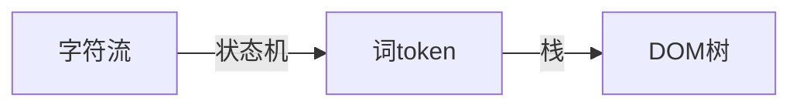
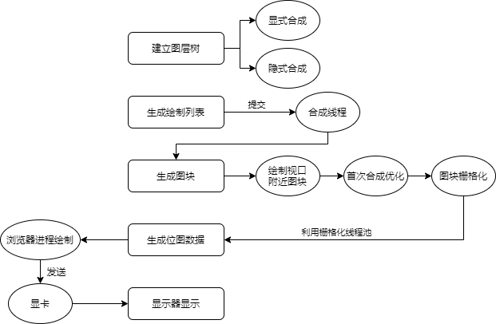
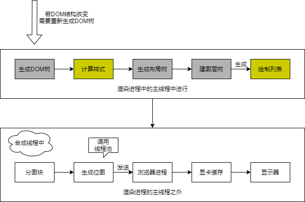
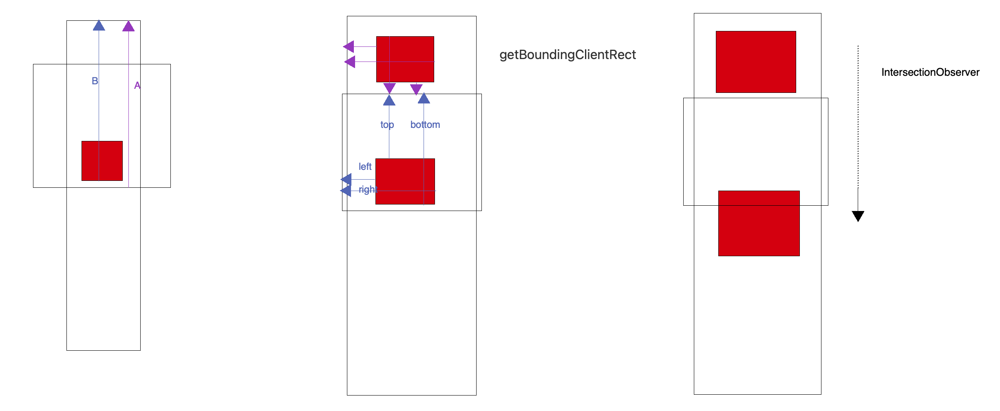

# 浏览器

[TOC]

- [浏览器](#浏览器)
  - [<a name="开始">开始</a>](#开始)
      - [<a name="用户代理">用户代理</a>](#用户代理)
  - [从输入URL到页面呈现发生了什么？](#从输入url到页面呈现发生了什么)
    - [网络](#网络)
      - [网络请求](#网络请求)
      - [<a name="远程主机响应">网络响应</a>](#网络响应)
    - [<a name="解析">解析</a>](#解析)
      - [构建DOM树](#构建dom树)
      - [样式计算](#样式计算)
      - [生成布局树（Layout Tree）](#生成布局树layout-tree)
    - [<a name="渲染">渲染</a>](#渲染)
      - [建立图层树（Layer Tree）](#建立图层树layer-tree)
      - [生成绘制列表](#生成绘制列表)
      - [生成图块并栅格化](#生成图块并栅格化)
      - [显示器显示内容](#显示器显示内容)
  - [重绘 & 回流](#重绘--回流)
      - [回流](#回流)
      - [重绘](#重绘)
      - [合成](#合成)
      - [指导意义](#指导意义)
  - [节流 & 防抖](#节流--防抖)
    - [节流](#节流)
    - [防抖](#防抖)
    - [加强版节流](#加强版节流)
  - [图片懒加载](#图片懒加载)
  - [<a name="内核">内核</a>](#内核)
      - [<a name="内核架构">内核架构</a>](#内核架构)
      - [<a name="Chromium">Chromium 架构</a>](#chromium-架构)
  - [浏览器本地存储](#浏览器本地存储)
    - [Cookie](#cookie)
    - [```WebStorage```](#webstorage)
      - [```localStorage```](#localstorage)
          - [和Cookie异同](#和cookie异同)
          - [操作方式](#操作方式)
          - [应用场景](#应用场景)
      - [`sessionStorage`](#sessionstorage)
          - [和`localStorage`异同](#和localstorage异同)
          - [应用场景](#应用场景-1)
    - [`IndexedDB`](#indexeddb)

## <a name="开始">开始</a>

浏览器是方便互联网用户通过界面解析和发送 HTTP 协议的软件。

#### <a name="用户代理">用户代理</a>

> 查看用户代理：打开 chrome 浏览器控制台 —— 输入`navigator.userAgent`

> 作用：

- 判断浏览器类型，采用兼容方案

- 判断是否为移动端

- 标识 H5 容器，方便调用 H5 特定接口

- 注意 `userAgent` 伪装成本很低，不要过于依赖


使用 Node.js 的 TCP 模块来获取，远程主机返回了什么：

```javascript
// net-for-http.js
const net = require("net");
const fs = require("fs");
const path = require("path");

const desPort = 80;
// const desHost = 'localhost';
const desHost = "123.57.205.204";

let allBuffer = null;

const client = net.createConnection(desPort, desHost, function () {
  console.log("connected to server!");
  client.write(
    "GET / HTTP /1.0\r\nHost: from-scratch0.github.io\r\nUser-Agent:Mozilla/5.0 (Windows NT 10.0; Win64; x64) AppleWebKit/537.36 (KHTML, like Gecko) Chrome/85.0.4183.83 Safari/537.36\r\nAccept:text/html\r\nAccept-Language:zh-CN,zh;q=0.9\r\n\r\n"
  );
});

client.on("data", function (data) {
  console.log("------receive data------");
  if (!allBuffer) {
    allBuffer = data;
  } else {
    allBuffer = Buffer.concat([allBuffer, data]);
  }
});

client.on("error", function (err) {
  console.log(err);
});

client.on("end", function () {
  console.log("connection end");
  const htmlContent = allBuffer.toString();
  // 解释页面的操作
  const ws = fs.createWriteStream(path.join(__dirname, "myBlog.html"));
  ws.write(htmlContent);
});
```

- [ ] 代码逻辑？

- [ ] 返回的字符串如何解析？返回的字符串如何呈现为图像？


## 从输入URL到页面呈现发生了什么？

### 网络

#### 网络请求

1. 构建请求

2. 查找强缓存

3. DNS解析

   由于我们输入的是域名，而数据包是通过IP地址传给对方的，因此我们需要得到域名对应的IP地址，这个过程需要依赖一个服务系统，这个系统将域名和 IP 一一映射，这个系统就叫做**DNS**（域名系统），得到具体 IP 的过程就是DNS解析

   值得注意的是，浏览器提供了**DNS数据缓存功能**，即如果一个域名已经解析过，那会把解析的结果缓存下来，下次处理直接走缓存，不需要经过 DNS解析

   另外，如果不指定端口的话，默认采用对应的 IP 的 80 端口

4. 建立TCP连接

   这里要提醒一点，Chrome 在同一个域名下要求同时最多只能有 6 个 TCP 连接，超过 6 个的话剩下的请求就得等待

   建立 TCP连接经历了三个阶段：三次握手、数据传输、四次挥手

5. 发送HTTP请求

#### <a name="远程主机响应">网络响应</a>

**响应组成**

```html
<!--起始行 -->
HTTP/1.1 200 OK
<!--服务器发送内容时间 -->
Date: Sun, 20 Sep 2020 09:28:18 GMT
<!--服务器 -->
Server: Apache/2.4.39 (Win64) OpenSSL/1.1.1b mod_fcgid/2.3.9a X-Powered-By:
PHP/5.6.9 Set-Cookie: security_session_verify=3a066f5caa71d408befa79c94327ea4f;
expires=Wed, 23-Sep-20 17:28:18 GMT; path=/; HttpOnly Set-Cookie:
USR2=y9yml28m%090%091600594098%09http%3A%2F%2Fwww.lib.seu.edu.cn%2Findex.php;
expires=Mon, 21-Sep-2020 09:28:18 GMT; Max-Age=86400; path=/ Set-Cookie:
security_session_verify=3a066f5caa71d408befa79c94327ea4f; expires=Wed, 23-Sep-20
17:28:18 GMT; path=/; HttpOnly Transfer-Encoding: chunked
<!--实体类型 -->
Content-Type: text/html; charset=utf-8

<!--实体内容 -->
11ff0
<!DOCTYPE html>
<html lang="zh-CN">
  <head>
    ...
  </head>
  <body>
    ...
  </body>
</html>
```

**网页内容组成**

- doctype：html 版本信息
- head
  - meta：元数据信息
    - charset：声明当前文档所用的字符编码
    - http-equiv：客户端行为，如渲染模式、缓存等
    - name[keywords]：搜索引擎使用
    - name[description]：搜索引擎使用
    - name[viewpoint]：浏览器视口设置
  - link
  - script
- body

> **响应完成之后怎么办？TCP 连接就断开了吗？**
>
> 不一定
>
> 这时候要判断`Connection`字段, 如果请求头或响应头中包含**Connection: Keep-Alive**，表示建立了持久连接，这样TCP连接会一直保持，之后请求统一站点的资源会复用这个连接
>
> 否则断开TCP连接，请求-响应流程结束

### <a name="解析">解析</a>


虚线表示该阶段依赖外部模块，不属于**渲染引擎**。

**重要组件**

- HTML 解释器：HTML 文本 —— DOM 树
- CSS 解释器：为 DOM 对象计算出样式信息
- JavaScript 引擎：解释 JS 代码，并使 JS 能调用 DOM 接口和 CSSOM 接口
- 布局：结合 CSS，计算出每个 DOM 对象的大小位置信息
- 绘图：将经过布局计算的 DOM 节点绘制成图像

- [ ] 浏览器如何处理外联资源？

  不同的外联资源，`webkit`中有不同的资源加载器，若不是特殊资源，加载过程不会阻碍渲染过程。

- [ ] CSS 放头部，JS 放尾部？

  一般 CSS 不会阻碍渲染过程，JS 会阻碍。现代浏览器会开启新的线程继续渲染。

- [ ] 浏览器在渲染前后？

  渲染前需加载资源，渲染后在 DOM 或 CSS 变化后，重新进行布局计算和重渲染。

#### 构建DOM树

由于浏览器无法直接理解HTML字符串，因此将这一系列的字节流转换为一种有意义并且方便操作的数据结构，这种数据结构就是DOM树

DOM树本质上是一个以`document`为根节点的多叉树

**HTML解析算法**

HTML 的文法并不是*上下文无关文法*

规范的 HTML 语法，是符合上下文无关文法的，能够体现它<u>非上下文无关</u>的是不标准的语法

常规的编程语言都是上下文无关的，而HTML却相反，也正是它非上下文无关的特性，决定了`HTML Parser`并不能使用常规编程语言的解析器来完成，需要另辟蹊径



1. **标记化**——词法分析

   这个算法输入为HTML文本，输出为HTML标记，也称为*标记生成器*，运用**有限自动状态机**来完成，即在当当前状态下，接收一个或多个字符，就会更新到下一个状态

   “词”（指编译原理的术语token，表示最小的有意义的单元）

   用状态机做词法分析，正是把每个词的“特征字符”逐个拆开成独立状态，然后再把所有词的特征字符链合起来，形成一个联通图结构

   在 C/C++ 和 JavaScript 中，实现状态机的方式大同小异：把每个函数当做一个状态，参数是接受的字符，返回值是下一个状态函数（状态机是一种没有办法封装的东西，永远不要试图封装状态机），通过“if else”来区分下一个字符做状态迁移，这里所谓的状态迁移，就是当前状态函数返回下一个状态函数

   | 示例词                         | 解释           |
   | ------------------------------ | -------------- |
   | ```<abc```                     | 开始标签的开始 |
   | ```a="xxx"```                  | 属性           |
   | ```/>```                       | 开始标签的结束 |
   | ```</xxx>```                   | 结束标签       |
   | ```hello world!```             | 文本节点       |
   | ```<!-- xxx -->```             | 注释           |
   | ```<![CDATA[hello world!]]>``` | CDATA数据节点  |

2. **建树**——语法分析

   为了构建DOM树，需要Node类，所有的节点都会是这个Node类的实例，解析器首先会创建一个```document```对象

   标记生成器会把每个标记的信息发送给**建树器**，建树器接收到相应的标记时，会创建对应的DOM对象，创建这个DOM对象后会做两件事情：

   1. 将DOM对象加入 DOM 树中。

   2. 将对应标记压入存放开放（与闭合标签意思对应）元素的栈中

      > 词（token）中，```tag start```和```tag end```是需要成对匹配的，**栈**正是用于匹配开始和结束标签的方案

   - 栈顶元素就是当前节点
   - 遇到属性，就添加到当前节点
   - 遇到文本节点，如果当前节点是文本节点，则跟文本节点合并，否则入栈成为当前节点的子节点
   - 遇到注释节点，作为当前节点的子节点
   - 遇到 tag start 就入栈一个节点，当前节点就是这个节点的父节点
   - 遇到 tag end 就出栈一个节点（还可以检查是否匹配）

#### 样式计算

CSS样式的来源一般是三种:

- link标签引用
- style标签中的样式
- 元素的内嵌style属性

1. **格式化样式表**

   浏览器是无法直接识别 CSS 样式文本的，因此渲染引擎接收到 CSS 文本之后第一件事情就是将其转化为一个结构化的对象，即```styleSheets```

   在浏览器控制台能够通过`document.styleSheets`来查看这个最终的结构，这个结构包含了以上三种CSS来源，为后面的样式操作提供了基础

2. **标准化样式属性**

   有一些 CSS 样式的数值并不容易被渲染引擎所理解，因此需要在计算样式之前将它们标准化，如`em`->`px`,`red`->`#ff0000`,`bold`->`700`等等

3. **计算每个节点的具体样式**

   计算的方式，主要是两个规则: **继承**和**层叠**

   继承：每个子节点都会默认继承父节点的样式属性，如果父节点中没有找到，就会采用浏览器默认样式，也叫`UserAgent`样式

   层叠：CSS 最大的特点在于它的层叠性，也就是最终的样式取决于各个属性共同作用的效果

   计算完样式之后，所有的样式值会被挂在到`window.computedStyle`当中，即可以通过JS来获取计算后的样式

#### 生成布局树（Layout Tree）

通过浏览器的布局系统确定元素的位置，也就是要生成一棵布局树(Layout Tree)

布局树生成的大致工作如下:

1. 遍历生成的 DOM 树节点，并把他们添加到布局树中
2. 计算布局树节点的坐标位置

这棵布局树只包含可见元素，对于 `head`标签和设置了`display: none`的元素，将不会被放入其中

### <a name="渲染">渲染</a>



#### 建立图层树（Layer Tree）

为了解决一些复杂的场景，比如3D动画如何呈现出变换效果，当元素含有层叠上下文时如何控制显示和隐藏等等，浏览器在构建完布局树之后，还会对特定的节点进行分层，构建一棵图层树(Layer Tree)

节点的图层会默认属于父亲节点的图层时，这些图层也称为**合成层**，但有显式合成和隐式合成两种方式来使节点的图层提升为一个单独的合成层

> **合成**（compositing）是一个性能考量
>
> 不合成则不会把子元素绘制到渲染的位图上的，这样，当父子元素的相对位置发生变化时，可以保证渲染的结果能够最大程度被缓存，减少重新渲染；每次都必须要重新绘制所有的元素
>
> 合成的过程，就是为一些元素创建一个“合成后的位图”（我们把它称为合成层），把一部分子元素渲染到合成的位图上面

**显式合成**

1. 拥有**层叠上下文**的节点

   层叠上下文也基本上是有一些特定的CSS属性创建的，一般有以下情况：

   - HTML根元素本身就具有层叠上下文

   - 普通元素设置`position`不为`static`并且设置了`z-index`属性，会产生层叠上下文

   - 元素的 `opacity` 值不是 1

   - 元素的 `transform` 值不是 `none`

   - 元素的 `filter`值不是 `none`

   - 元素的 `isolation`值是`isolate`

   - `will-change`指定的属性值为上面任意一个

     > 新的 CSS 标准中，规定了 will-change 属性，可以由业务代码来提示浏览器的合成策略，灵活运用这样的特性，可以大大提升合成策略的效果

2. 需要**剪裁**的地方

   比如一个div，只给他设置 100 * 100 像素的大小，而在里面放了非常多的文字，那么超出的文字部分就需要被剪裁；当然如果出现了滚动条，那么滚动条会被单独提升为一个图层

**隐式合成**

简单来说就是层叠等级低的节点被提升为单独的图层之后，那么所有层叠等级比它高的节点 *都会* 成为一个单独的图层

隐式合成其实隐藏着巨大的风险，如果在一个大型应用中，当一个`z-index`比较低的元素被提升为单独图层之后，层叠在它上面的的元素统统都会被提升为单独的图层，可能会增加上千个图层，大大增加内存的压力，甚至直接让页面崩溃，这就是**层爆炸**的原理

值得注意的是，当需要`repaint`时，只需要`repaint`本身，而不会影响到其他的层

#### 生成绘制列表

接下来渲染引擎会将图层的绘制拆分成一个个绘制指令，比如先画背景、再描绘边框......然后将这些指令按顺序组合成一个待绘制列表，相当于给后面的绘制操作做了一波计划

> 可以在 Chrome 开发者工具中在设置栏中展开 `more tools`, 然后选择`Layers`面板，就能看到下面的绘制列表

#### 生成图块并栅格化

**绘制**是把“位图最终绘制到屏幕上，变成肉眼可见的图像”的过程，不过一般来说，浏览器并不需要用代码来处理这个过程，浏览器只需要把最终要显示的位图交给操作系统即可

在渲染进程中绘制操作是由专门的线程来完成的，这个线程叫**合成线程**，绘制列表准备好了之后，渲染进程的主线程会给合成线程发送`commit`消息，把绘制列表提交给合成线程

合成线程要做的第一件事情就是将图层**分块**，这些块的大小一般不会特别大，通常是 256 * 256 或者 512 * 512 这个规格，这样可以大大加速页面的首屏展示

> 计算机图形学中，我们使用的方案就是“**脏矩形**”算法，也就是把屏幕均匀地分成若干矩形区域
>
> 当鼠标移动、元素移动或者其它导致需要重绘的场景发生时，我们只重新绘制它所影响到的几个矩形区域就够了，比矩形区域更小的影响最多只会涉及 4 个矩形，大型元素则覆盖多个矩形
> 设置合适的矩形区域大小，可以很好地控制绘制时的消耗，设置过大的矩形会造成绘制面积增大，而设置过小的矩形则会造成计算复杂
> 重新绘制脏矩形区域时，把所有与矩形区域有交集的合成层（位图）的交集部分绘制即可

Chrome 采用了一个策略：在首次合成图块时只采用一个**低分辨率**的图片，这样首屏展示的时候只是展示出低分辨率的图片，这个时候继续进行合成操作，当正常的图块内容绘制完毕后，会将当前低分辨率的图块内容替换

渲染进程中专门维护了一个**栅格化线程池**，专门负责把图块转换为位图数据，合成线程会选择视口附近的图块，把它交给栅格化线程池生成位图

生成位图的过程实际上都会使用 GPU 进行加速，生成的位图最后发送给合成线程

#### 显示器显示内容

栅格化操作完成后，合成线程会生成一个绘制命令，即`DrawQuad`，并发送给浏览器进程

浏览器进程中的`viz`组件接收到这个命令，根据这个命令，把页面内容绘制到内存，也就是生成了页面，然后把这部分内存发送给显卡

> 无论是 PC 显示器还是手机屏幕，都有一个固定的刷新频率，一般是 60 HZ，即 60 帧，也就是一秒更新 60 张图片，一张图片停留的时间约为 16.7 ms
>
> 而每次更新的图片都来自显卡的**前缓冲区**，而显卡接收到浏览器进程传来的页面后，会合成相应的图像，并将图像保存到**后缓冲区**，然后系统自动将前缓冲区和后缓冲区对换位置，如此循环更新
>
> 当某个动画大量占用内存的时候，浏览器生成图像的时候会变慢，图像传送给显卡就会不及时，而显示器还是以不变的频率刷新，因此会出现卡顿，也就是明显的掉帧现象

**资源加载机制**

资源加载器


## 重绘 & 回流



#### 回流

回流也叫重排

触发回流的时候，如果 DOM 结构发生改变，则重新生成渲染 DOM 树，然后将后面的流程(包括主线程之外的任务)全部走一遍

相当于将解析和合成的过程重新又走了一篇，开销是非常大的

**触发条件**

当我们对 DOM 结构的修改引发 DOM 几何尺寸变化的时候，会发生回流的过程：

1. 一个 DOM 元素的几何属性变化，常见的几何属性有`width`、`height`、`padding`、`margin`、`left`、`top`、`border` 等等
2. 使 DOM 节点发生增减或者移动
3. 读写 `offset`族、`scroll`族和`client`族属性的时候，浏览器为了获取这些值，需要进行回流操作
4. 调用 `window.getComputedStyle` 方法

#### 重绘

当 DOM 的修改导致了样式的变化，并且没有影响几何属性的时候，会导致重绘(`repaint`)

由于没有导致 DOM 几何属性的变化，因此元素的位置信息不需要更新，从而省去布局的过程

跳过了生成布局树和建图层树的阶段，直接生成绘制列表，然后继续进行分块、生成位图等后面一系列操作。

可以看到，<u>重绘不一定导致回流，但回流一定发生了重绘</u>

#### 合成

直接合成，比如利用 CSS3 的`transform`、`opacity`、`filter`这些属性就可以实现合成的效果，也就是大家常说的**GPU加速**

在合成的情况下，会直接跳过布局和绘制流程，直接进入非主线程处理的部分，即直接交给**合成线程**处理，交给它处理有两大好处:

1. 能够充分发挥GPU的优势

   合成线程生成位图的过程中会调用线程池，并在其中使用GPU进行加速生成，而GPU 是擅长处理位图数据的

2. 没有占用主线程的资源，即使主线程卡住了，效果依然能够流畅地展示

#### 指导意义

1. 避免频繁使用 style，而是采用修改`class`的方式

2. 使用`createDocumentFragment`进行批量的 DOM 操作

3. 对于 `resize`、`scroll` 等进行防抖/节流处理

4. 添加 `will-change: tranform` ，让渲染引擎为其单独实现一个图层，当这些变换发生时，仅仅只是利用合成线程去处理这些变换，而不牵扯到主线程，大大提高渲染效率

   当然这个变化不限于`tranform`, 任何可以实现合成效果的 CSS 属性都能用`will-change`来声明


## 节流 & 防抖

### 节流

节流的核心思想: 如果在定时器的时间范围内再次触发，则不予理睬，等当前定时器完成，才能启动**下一个定时器任务**。这就好比公交车，10 分钟一趟，10 分钟内有多少人在公交站等我不管，10 分钟一到我就要发车走人！

```javascript
function throttle(fn, interval) {  
    let flag = true;  
    return funtion(...args) {    
        let context = this;    
        if (!flag) return;    
        flag = false;    
        setTimeout(() => {      
            fn.apply(context, args);      
            flag = true;    
        }, interval);  
    };
}
```


```javascript
const throttle = function(fn, interval) {  
    let last = 0;  
    return function (...args) {    
        let context = this;    
        let now = +new Date();    
        // 还没到时间    
        if(now - last < interval) return;    
        last = now;    
        fn.apply(this, args);
    }
}
```

### 防抖

核心思想: 每次事件触发则删除原来的定时器，建立新的定时器。跟王者荣耀回城功能类似，你反复触发回城功能，那么只认最后一次，从最后一次触发开始计时

```javascript
function debounce(fn, delay) {  
    let timer = null;  
    return function (...args) {    
        let context = this;    
        if(timer) clearTimeout(timer);    
        timer = setTimeout(function() {      
            fn.apply(context, args);    
        }, delay);  
    }
}
```

### 加强版节流

可以把防抖和节流放到一起，因为防抖有时候触发的太频繁会导致一次响应都没有，我们希望到了固定的时间必须给用户一个响应

```javascript
const throttle = function throttle(func, wait = 500) {
    let previous = 0,
        timer = null;
    return function anonymous(...params) {
        let now = +new Date(),
            remaining = wait - (now - previous);
        if (remaining <= 0) { // 到时间了
            clearTimeout(timer);
            timer = null;
            previous = now;
            func.call(this, ...params);
        } else if (!timer) {
            timer = setTimeout(() => {
                clearTimeout(timer);
                timer = null;
                previous = +new Date();
                func.call(this, ...params);
            }, remaining);
        }
    };
};
```


## 图片懒加载

```css
html,
body {
  background: #d6d7db;
}

.container {
  box-sizing: border-box;
  margin: 20px auto;
  width: 760px;
  display: flex;
  justify-content: space-between;
  align-items: flex-start;
}

.container .column {
  box-sizing: border-box;
  width: 240px;
}

.card {
  margin-bottom: 10px;
  padding: 5px;
  background: #fff;
  /*box-shadow: 3px 3px 10px 0 #222;*/
}

.card a {
  display: block;
}

.card a .lazyImageBox {
  /* height: xxx;  如果是需要进行图片延迟加载，在图片不显示的时候，我们要让盒子的高度等于图片的高度，这样才能把盒子撑开（服务器返回给我们的数据中，一定要包含图片的高度和宽度） */
  background: #f4f4f4;
  overflow: hidden;
}

.card a .lazyImageBox img {
  width: 100%;
  /* 过渡效果 */
  opacity: 0;
  transition: opacity 0.3s ease;
}

.card a p {
  margin-top: 5px;
  color: #000;
  font-size: 12px;
  line-height: 20px;
}
```


```html
<body>
	<div class="container clearfix">
		<div class="column">
			<!-- <div class="card">
				<a href="#">
					<div class="lazyImageBox">
						
					</div>
					<p>图片说明</p>
				</a>
			</div> -->
		</div>
		<div class="column"></div>
		<div class="column"></div>
	</div>

	<script src="js/index.js"></script>
</body>
```




#### 一 `clientHeight`、`scrollTop` 和 `offsetTop`

```javascript
/* 第一种方案中获取任意元素距离BODY的偏移 */
const offset = element => {
    let parent = element.offsetParent,
        top = element.offsetTop,
        left = element.offsetLeft;
    while (parent) {
        left += parent.clientLeft;
        left += parent.offsetLeft;
        top += parent.clientTop;
        top += parent.offsetTop;
        parent = parent.offsetParent;
    }
    return {
        top,
        left
    };
};
```


#### 二 `getBoundingClientRect`

```javascript
(async function () {
    let columns = Array.from(document.querySelectorAll('.column'));

    // 获取图片数据
    const query = () => {
        return fetch('/data.json')
            .then(response => response.json());
    };

    // 数据绑定「瀑布流效果实现」
    const binding = data => {
        data = data.map(item => {
            let {
                width,
                height
            } = item;
            item.height = height / (width / 230);
            item.width = 230;
            return item;
        }); // 转化图片宽高
        
        for (let i = 0; i < data.length; i += 3) {
            let group = data.slice(i, i + 3);
            columns.sort((a, b) => b.offsetHeight - a.offsetHeight);
            group.sort((a, b) => a.height - b.height);
            
            group.forEach((item, index) => {
                let {
                    height,
                    title,
                    pic,
                    link
                } = item;
                let card = document.createElement('div');
                card.className = "card";
                // 
                card.innerHTML = `<a href="${link}" target="_blank">
                    <div class="lazyImageBox" style="height:${height}px">
                        
                    </div>
                    <p>${title}</p>
                </a>`;
                columns[index].appendChild(card);
            });
        }
    };

    // 第一次加载页面
    let data = await query();
    binding(data);

    // 单张图片延迟加载
    const lazyImage = imageBox => {
        let img = imageBox.querySelector('img');
        img.src = img.getAttribute('data-image');
        img.onload = () => {
            img.style.opacity = 1;
        };
        // 处理过的盒子设置一个标志
        imageBox.setAttribute('isLoad', true);
    };
    
    /* 图片延迟加载 */
    let winH = document.documentElement.clientHeight; // 视口高度
    const lazying = () => {
        let imageBoxs = Array.from(document.querySelectorAll('.lazyImageBox'));
        imageBoxs.forEach(imageBox => {
            let isLoad = imageBox.getAttribute('isLoad');
            if (isLoad) return;

            // 方案一: clientHeight、scrollTop 和 offsetTop
            // 盒子底边距离BODY的偏移<=浏览器底边距离BODY的偏移 “完全出现在视口中了”
            /* 
            let B = offset(imageBox).top + imageBox.offsetHeight,
                A = winH + document.documentElement.scrollTop; // 视口高度 + 滚动条卷去的高度
            if (B <= A) lazyImage(imageBox); 
            */

            // 方案二：getBoundingClientRect
            let B = imageBox.getBoundingClientRect().top,
                A = winH;
            if (B <= A) lazyImage(imageBox);
        });
    };

    lazying();
    // 函数节流：正常情况下，页面在滚动中，每间隔5MS左右，事件就触发一次
    window.onscroll = throttle(lazying); 
})(); 
```


####  三 `IntersectionObserver`

这是浏览器内置的一个`API`，实现了监听window的scroll事件、判断是否在视口中、节流三大功能

```javascript
let observer = new IntersectionObserver(changes => {
    //changes 是被观察的元素集合
    changes.forEach(item => {
        let {
            isIntersecting,
            target
        } = item;
        if (isIntersecting) {
            lazyImage(target);
            observer.unobserve(target);
        }
    });
}, {
    threshold: [0] // 1、o.5
});
let imageBoxs = Array.from(document.querySelectorAll('.lazyImageBox'));
imageBoxs.forEach(imageBox => {
    observer.observe(imageBox);
});
```


## <a name="内核">内核</a>

对操作系统而言，内核是操作系统核心，是第一层基于硬件的软件扩充，提供最核心基础的服务。

应用系统通过内核进行系统调用（用户态 —— 内核态）来使用计算机硬件。内核代码简洁高效，最底层的服务一点微小错误也会造成整个系统崩溃。基于一个稳定内核，开发者可以构建适合不同场景的操作系统和应用软件。

相似的，**浏览器内核**提供 API 给浏览器开发者使用，提供最核心的功能，如加载和渲染网页，调用操作系统所提供的服务

#### <a name="内核架构">内核架构</a>

`webkit` 除了渲染功能，还需获取网络资源，支持不同的浏览器，支持不同的操作系统，包含调试工具。


圆角框表示该部分模块在不同浏览器使用 `webkit` 的实现是不同的，直角框基本一致。

#### <a name="Chromium">Chromium 架构</a>

基于 `webkit` 内核即可构架浏览器应用。

> 除去 `webkit` 内核完成的功能，**浏览器的工作**有哪些？

- 资源管理
- 多页面管理
- 插件和扩展
- 账户和同步
- 安全机制
- 多系统支持

- [ ] 进程、线程、IPC（进程通讯）、线程同步？

_Chromium 多进程架构_


**主要进程：**

- Browser 进程：主进程，负责浏览器界面，页面管理……
- Render 进程
- NPAPI 插件进程
- GPU 进程

进程间通讯，相互调用

多进程架构目的：

- 职责分离，故障范围小
- 隔离性
- 性能


## 浏览器本地存储

### Cookie

用来做**状态存储**

### ```WebStorage```

#### ```localStorage```

###### 和Cookie异同

`localStorage`有一点跟`Cookie`一样，就是针对一个域名，即在同一个域名下，会存储相同的一段```localStorage```。

区别:

1. 容量：`localStorage` 的容量上限为**5M**，相比于`Cookie`的 4K 大大增加，当然这个 5M 是针对一个域名的，因此对于一个域名是持久存储的。
2. 只存在客户端，默认不参与与服务端的通信：这样就很好地避免了 Cookie 带来的性能问题和安全问题
3. 接口封装：通过`localStorage`暴露在全局，并通过它的 `setItem` 和 `getItem`等方法进行操作，非常方便。

###### 操作方式

接下来我们来具体看看如何来操作`localStorage`。

```javascript
let obj = { name: "sanyuan", age: 18};
localStorage.setItem("name", "sanyuan"); localStorage.setItem("info", JSON.stringify(obj));
```

接着进入相同的域名时就能拿到相应的值:

```javascript
let name = localStorage.getItem("name");
let info = JSON.parse(localStorage.getItem("info"));
```

从这里可以看出，`localStorage`存储的都是字符串，如果是存储对象需要调用`JSON`的`stringify`方法，并且用`JSON.parse`来解析成对象

###### 应用场景

利用`localStorage`的较大容量和持久特性，可以利用`localStorage`存储一些内容稳定的资源，比如官网的`logo`，存储`Base64`格式的图片资源，因此利用`localStorage`

#### `sessionStorage`

###### 和`localStorage`异同

`sessionStorage`以下方面和`localStorage`一致:

- 容量：容量上限也为 5M。
- 只存在客户端，默认不参与与服务端的通信
- 接口封装：除了`sessionStorage`名字有所变化，存储方式、操作方式均和`localStorage`一样。

但`sessionStorage`和`localStorage`有一个本质的区别，那就是前者只是会话级别的存储，并不是持久化存储，会话结束，也就是页面关闭，这部分`sessionStorage`就不复存在了

###### 应用场景

1. 可以用它对表单信息进行维护，将表单信息存储在里面，可以保证页面即使刷新也不会让之前的表单信息丢失
2. 可以用它存储本次浏览记录，如果关闭页面后不需要这些记录，用`sessionStorage`就再合适不过了，事实上微博就采取了这样的存储方式

### `IndexedDB`

`IndexedDB`是运行在浏览器中的**非关系型数据库**, 本质上是数据库，绝不是和刚才```WebStorage```的 5M 一个量级，理论上这个容量是没有上限的，为大型数据的存储提供了接口

使用参见MDN 教程文档

`IndexedDB`除了拥有数据库本身的特性，比如支持事务，存储二进制数据，还有这样一些特性需要格外注意：

1. 键值对存储：内部采用对象仓库存放数据，在这个对象仓库中数据采用键值对的方式来存储
2. 异步操作：数据库的读写属于 I/O 操作, 浏览器中对异步 I/O 提供了支持
3. 受同源策略限制，即无法访问跨域的数据库